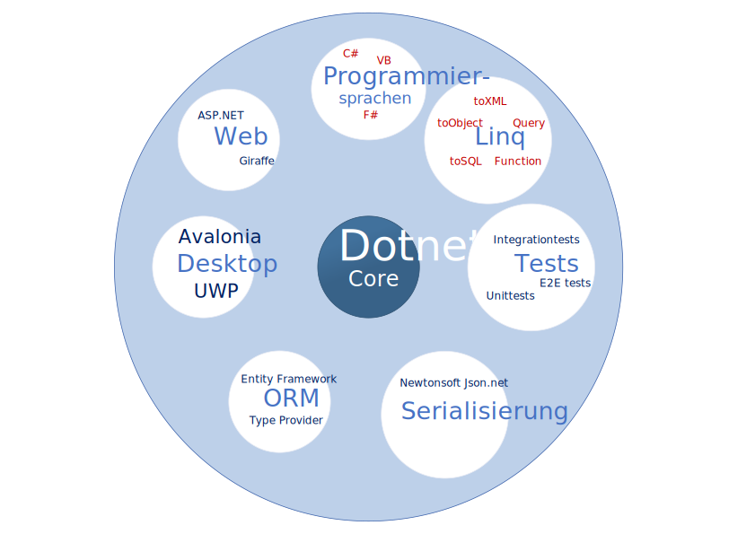
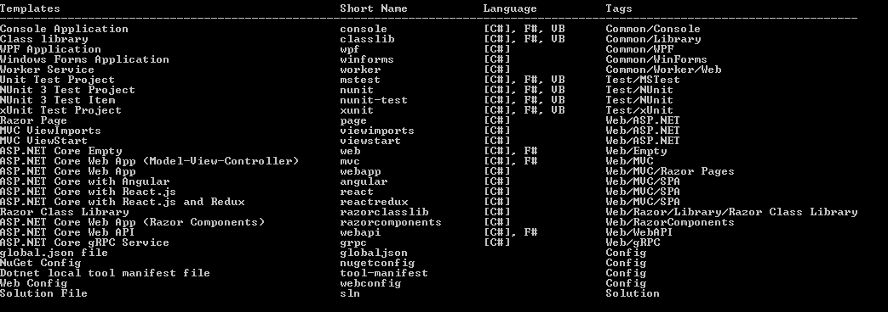
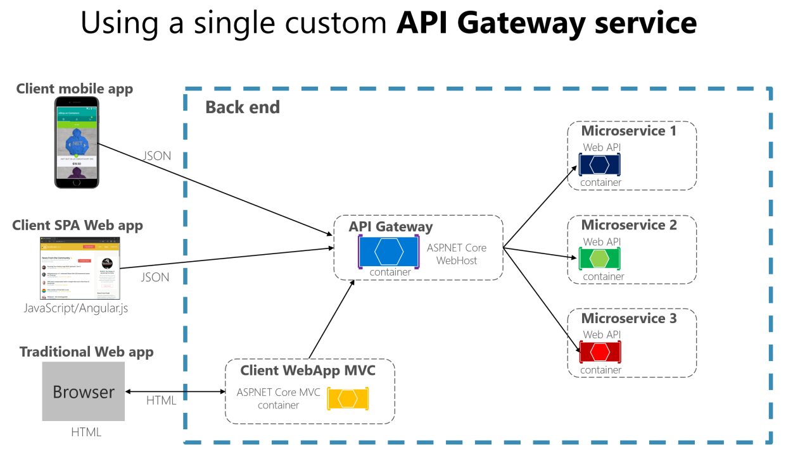
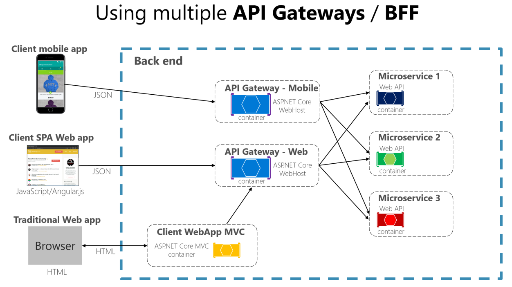

# Dotnet Core

## Einleitung

### Was ist dotnet Core?  



dotnet Core ist ein Opensource Plattform. Diese Plattform soll in Zukunft das dotnet Framework ersetzen. Eine große Änderung ist es Plattformunabhängig zu werden. Das dotnet Team stellt eine CLI zur Verfügung um ein Projekt zu erstellen, Kompilieren und testen. Die dotnet core Plattform kann mit VB, C# und F# genutzt werden. Außerdem wurden die einzelnen Komponenten von dem Grundsystem endkapselt.

### Wer entwickelt dotnet core?

Die Entwicklung wird von Microsoft koordiniert der Programm Manager ist Richard Lander. Es handelt sich bei dotnet core um ein Opensource Produkt somit kann jeder Nutzer an der Entwicklung teilnehmen.

### Weiter Entwicklung

Das dotnet Core Team hat für die Version 3.0 die in der zweiten Hälfte 2019 veröffentlicht werden soll vorgesehen Desktop Gui Entwicklung, Razorkomponenten , c# 8.0 support und noch vieles mehr.

Eine liste aller Änderungen sind [hier](https://docs.microsoft.com/de-de/dotnet/core/whats-new/dotnet-core-3-0) erhältlich.

## Frameworks

### Web

#### ASP.NET

Ein Framework welches genutzt werden kann um dynamische Webseiten und Webservices zu entwickeln. Es bietet eine eigene Templateengine an mit dem Namen Razor. 

ASP.Net nutzt Klassen und Attribute für das Routing.

``` fsharp
[<Route("api/[controller]")>]
[<ApiController>]
type ValuesController () =
    inherit ControllerBase()

    [<HttpGet>]
    member this.Get() =
        let values = [|"value1"; "value2"|]
        ActionResult<string[]>(values)
```

Die Route ist nicht direkt lesbar ohne zu wissen das [controller] durch Values ersetzt wird.
Trotz das Klassen verwendet werden ist keine spezielle Ordner Struktur vorgeschrieben bzw. benötigt welches ein suchen nach der zugehörigen Klasse verursacht. Da die eigentliche Route in der Datei der Klasse deklariert wird.

##### Http Request Pipeline


In ASP.NET ist eine Pipeline verfügbar welche das hinzufügen von Middleware erlaubt. Eine detaillierte Beschreibung zu diesem Thema gibt es [hier](<https://docs.microsoft.com/de-de/aspnet/core/fundamentals/middleware/?view=aspnetcore-2.2>). Ein paar Beispiele für diese Middleware:

- Json Parser
- HTTPS Redirect
- Database Connection

**Unterschiedliche Middlewares**

`Use` erstellt eine uneingeschränkte Middleware und kann von der vorherigen mithilfe von next aufgerufen werden.

`Map` erstellt eine bedingte Middleware Wobei der erste Parameter beim erstellen angibt anhand welchen kriteriums die unterscheidung stattfinden soll.

`Run` erstellt eine Terminale Middleware welche mithilfe von Run aus der vorherigen aufgerufen werden kann.

**Middleware vs. Service**

Eine Middleware und ein Service unterscheiden sich gering bis gar nicht. Unter einem Service wird verstanden der Server, Parser, Datenbankverbindung oder Framework. Während eine Middleware z.b. Logging wäre.

Eine Middleware und ein Service können identisch geschrieben werden und es gibt keine Vorgabe ob erst Service oder erst Middlewares vorkommen müssen.

Services bieten meist noch einen Schritt der Konfiguration an und können daher zumindest etwas erkannt werden. Diese Konfiguration kann aber auch in manchen fällen weggelassen werden.

**Server**

Ein **IIS** Server, ist ein Multifunktionsserver welcher sehr viele Zusatz Funktionen mitliefert.

Ein **Kestrel** Server, ist ein Speziell für dotnet core entwickelter Server. Welcher auf reine Performance setzt und Sonderfunktionen außen vorlässt.

Microsoft empfiehlt beim nutzen von Kestrel nach außen einen weiteren Server als Proxy vorzuschalten.


|                            | IIS           | Kestrel                                        |
| -------------------------- | ------------- | ---------------------------------------------- |
| Platform Support           | Windows/Linux | Windows/Linux/Mac                              |
| Statische Webseiten        | Ja            | Ja                                             |
| HTTP Access Logs           | Ja            | Nein                                           |
| Port Sharing               | Ja            | Nein                                           |
| SSL Zertifikat             | Ja            | Intern (Nur zwischen Proxy und Kestrel Server) |
| Windows Authentifikation   | Ja            | Nein                                           |
| Managment Konsole          | Ja            | Nein                                           |
| Prozess Aktivierung        | Ja            | Nein                                           |
| Anwendungsinitialisierung  | Ja            | Nein                                           |
| Request Filtering & Limits | Ja            | Nein                                           |
| IP & Domain Restrictions   | Ja            | Nein                                           |
| HTTP Redirect Rules        | Ja            | Nein                                           |
| WebSocket Protocol         | Ja            | Middleware                                     |
| Response Output Caching    | Ja            | Nein                                           |
| Compression                | Optional      | Optional                                       |
| FTP Server                 | Ja            | Nein                                           |


##### Razor

Eine von Microsoft entwickelte Template Engine.

##### Razorkomponente

Ein Erweiterung von Razor welches erlaubt Komponenten zu entwickeln Ähnlich wie bei Angular. Diese Komponenten können sowohl auf dem Server oder mithilfe von Blazzor als Webassembly beim Klienten Aktionen ausführen.

#### Giraffe


Ein auf ASP.NET aufbauendes Framework welches stärker Funktionalen Aspekte einbringt. 

Anstelle von dem Routing von ASP.Net kann eine Art Suchbaum erstellt werden.

``` fsharp
let webApp =
    choose [
        subRoute "/api"
            (choose [
                GET >=> choose [
                    route "/Values" >=> handleGetHello
                ]
            ])
        setStatusCode 404 >=> text "Not Found" ]
```

Das Routing kann komplex werden, dennoch kann auf einen Blick erkannt werden, welcher Befehl wohin gehen wird. Routen die Authentifizierung erfordern können auch direkt hier erkannt werden und nicht in einer Funktion welche nur vom Framework intern aufgerufen werden.

### ORM

#### Entity Framework (EF)

Ein von Microsoft entwickeltes Framework für Datenbank Operationen für dotnet Framework. Es handelt sich beim Enity Framework um ein Objekt Relations Model. Das EF bietet grundsätzlich zwei Vorgehensweisen an Code-First und Database-First. Es bietet ein CLI Tool welches Migrationen erstellen ermöglicht. Diese Können beim Starten der Anwendung kontrolliert werden. Dies ermöglicht im Laufenden System einfache Änderungen am Datenbank Model.

**Entity Framework Core (EF Core)**

EF Core ist eine Open source Version vom EF. EF Core ist kompatible mit dotnet core.

### Parser

#### Newtonsoft JSON.NET

JSON.Net von Newtonsoft ist ein Json Parser Framework welches ein Json to Object Parser beinhaltet sowie Object to Json. Es beinhaltet auch eine Service Komponente welche mit ASP.NET genutzt werden kann.

### Test Frameworks

|                    | NUnit                          | xUnit               | Expecto      |
| ------------------ | ------------------------------ | ------------------- | ------------ |
| Struktur           | OOP                            | OOP oder Funktional | Funktional   |
| Entwickler         | Open Source                    | Open Source         | Open Source  |
| Programmiersprache | c#, VB, f#                     | c#, VB, f#          | F#           |
|                    | Assert.That(1, Is.EqualTo(1)); | Assert.Equal        | Expect.equal |


## F# #

F# ist eine Plattform unabhängige funktionale Programmiersprache. Welche außerdem ein Open-Source Projekt ist. F# kann genutzt werden um Objekt Orientiert oder Imperativ zu programmieren.

F# und funktionale Programmiersprachen versuchen die Arbeit des Programmierers zu vereinfachen indem dieser weniger schreiben muss sowie sich weniger sorgen um Datentypen zu machen.

Beim programmieren mit F# kann man dennoch den Typen angeben um selbst Einschränkungen vorzunehmen sonst erfüllt diese Aufgabe der Compiler. Für eine Liste aller Datentypen stellt Microsoft [Hier](https://docs.microsoft.com/de-de/dotnet/fsharp/language-reference/fsharp-types) eine Liste zur Verfügung.

| Vorteile | Nachteile |
| --- | --- |
| Einfacher zu testen | Kein vollständiges OOP möglich |
| Leicht zu schreibener Code | Pattern matching kann komplex werden |
| Zeit kann sinnvoller eingesetzt werden | |
| Pattern matching | |

### Variablen

Der F# Compiler lägt fest welcher Datentyp benutzt werden muss. Es gibt außerdem kein implizites Casting. Der Name für eine Variable oder Funktion kann jeden Buchstaben enthalten. Außerdem ist es möglich mit 2 Backticks am Anfang auch Sonderzeichen zu verwenden. 

``` fsharp
let Name = Wert
let ``besonderer Name`` = Wert

let zahl:int = 0

let funktion a = 
	let x = a * 2 in // lokale Variable
	x

let rec fib i = 
   match i with
   | 1 -> 1
   | 2 -> 1
   | n -> fib(n-1) + fib(n-2)
```

### Schleifen

In F# gibt es drei arten von schleifen Zähler gesteuerte Schleife, Kopfgesteuerte Schleife und für jedes Element Schleife. Diese Schleifen existieren zwar sind aber in der Funktionalen Programmierung selten bis gar nicht verwendet.

``` fsharp
for i = 1 to 10 do
    printf "%d " i
for i = 10 downto 1 do
	printf "%d " i
```

``` fsharp
while Bedingung do
    Anweisungen
```

Für jedes Element 
``` fsharp
for pattern in enumerable-expression do
    body-expression

for (i,j) in [(1,2),(3,4)] do
	printf "first: %i" i
    printf "second: %i" j
    
let sum = 0
for (_,_) in [(1,2),(3,4)] do
	printf "Parameter werden nicht benötigt"
    sum += 1

```
### Funktional Iterieren
``` fsharp
List.iter (fun x -> printf "%i" x) [1..10] 
```

### Enum / Typen

Typen sind ähnlich wie Objekte. Der größte unterschied ist das es weder Konstruktor noch Funktionen für diese Objekte gibt.

``` fsharp
type enum = 
	| A 
	| B 
	| C

type Typ = { Vorname:string ; Nachname:string; alter:int }
let beispielNutzer:Typ = { Vorname = "Beispiel"; Nachname = ""; alter = 0 }
```

### Funktionen

Funktionen in F# haben immer mindestens einen Parameter und immer einen Rückgabe wert. Um eine Funktion ohne Parameter zu erstellen kann der typ unit benutzt werden welcher das äquivalent zu null in anderen Sprachen ist.

```fsharp
let readInput() = 
    printfn ":"
    Console.ReadLine()

let parse a = double a

let calc a = a ** a

let print a = printfn "Die Zahl ist %f" a
```

Parameter und Rückgabewerte benötigen keinen Typen diese Aufgabe übernimmt der Compiler. 

| Funktion  | Parameter | Rückgabewert |
| --------- | --------- | ------------ |
| readInput | unit      | string       |
| parse     | string    | double       |
| calc      | double    | double       |
| print     | string    | unit         |


#### Pipelining

Pipelining dient dazu lesbare aneinander Reihungen von Funktionen zu schreiben.

``` fsharp
let reihenfolge  = readInput |> parse |> calc |> print

reihenfolge 
```

#### rekursive Funktionen

In der Grundkonfiguration kann eine Funktion nicht von sich selbst aufgerufen werden. Um diese Funktionalität zu gewähren muss das Keyword **rec** vor dem Funktionsnamen geschrieben werden.

Hier ein Beispiel mit der [McCarthy91](https://en.wikipedia.org/wiki/McCarthy_91_function) Funktion

``` fsharp
let rec McCarthy91 a = 
    if a > 100 then a - 10 
    else McCarthy91 (McCarthy91 (a + 11))
```
### Pattern Matching

Pattern matching kann wie ein Switchcase genutzt werden.

```fsharp
match i with
    | 0 -> 0 
    | 1 -> 1
    | 2 -> 4
    | n -> n*n
```

Es gibt eine Erweiterung welche Active Pattern heißt und es erlaubt Funktionen oder Bedingungen als Case zu definieren.

```fsharp
let rec McCarthy91 a = 
	match a with
    | n when a > 100 -> n-10
    | n -> McCarthy91 (McCarthy91 (n + 11))
```


### F# Magie Active Pattern

Hier ein Umgekehrte polnische Notation Rechner welcher einen String erhält und alle Grundrechenarten auf diesen anwenden kann. [Hier](<https://de.wikipedia.org/wiki/Umgekehrte_polnische_Notation>) gibt es eine Erklärung der Notation.

``` fsharp
let RPNcalculator(s : string) = 
    let solve items current = 
        match (current, items) with
        | "+", y::x::t -> (x + y)::t
        | "-", y::x::t -> (x - y)::t
        | "*", y::x::t -> (x * y)::t
        | "/", y::x::t -> (x / y)::t
        | _ -> (float current)::items
    (s.Split(' ') |> Seq.fold solve []).Head
```


## getting started with dotnet core

Download und Installation kann [hier](<https://dotnet.microsoft.com/download>) gefunden werden.

nach der Installation söllte die dotnet CLI verfügbar sein.

Um jetzt zu beginnen bietet die CLI die Funktion ein Projekt anhand eines Templates vorzubereiten. Um eine Liste aller Templates zu erhalten gibt es den Befehl: 

``` bash
dotnet new --list
```



In dieser Tabelle kann erkannt werden für welche Programmiersprache dieses Template zur Verfügung steht.


``` bash
dotnet new webapi -lang F#
```


## Funktionen  (Platzhalter)


### Microservices

[Micro Services Beispiel von Microsoft](https://docs.microsoft.com/de-de/dotnet/standard/microservices-architecture/)

Microservices ermöglichen Programme zu schreiben welche genau eine Aufgabe erfüllen und auch Ihre eigene Datenbank dafür haben.

Hier ein Beispiel mit einer gemeinsamen API für Mobile und Web App. Zusätzlich wird hier auch gezeigt wie eine ASP.NET Core Anwendung funktionieren könnte.



Ein großer Vorteil von Micro Services ist, dass diese von verschiedenen Anwendungen aufgerufen werden können. 



### Codebeispiele

#### F# #

##### Linq

F# unterstützt nur den Querysyntax und nicht den Funktionssyntax. 

``` F#
let list = ["Beispiel"; "Text"; "ab"]
let abfrage = query { 
    for text in list do 
    where (text.Length > 3) 
    select text 
    }
abfrage |> Seq.iter (fun x -> printfn "%s" x)
```

Für eine Sammlung aller Keywords und 

#### Entity Framework
```c#
class Context : DbContext
{
   private const string connectionString = @"Data Source=:memory:;";
   protected override void OnConfiguring(DbContextOptionsBuilder optionsBuilder)
   {
      // dotnet core configuration was für ein Server benutzt werden sll
      optionsBuilder.UseSqlite(connectionString);
      // optionsBuilder.UseSqlServer(connectionString)
   }
   public DbSet<Nutzer> Nutzer { get; set; }
   public DbSet<Nachricht> Nachrichten { get; set; }
}
```

```c#
class Nutzer
{
   public int id { get; set; }
   public string name { get; set; }
   private ICollection<Nachrichten> Nachrichten { get; set; }
}

class Nachrichten
{
   public int id { get; set; }
   public string nachricht { get; set; }
   public Nutzer Nutzer { get; set; }
}
```

```c#
class Program
{
   static void Main(string[] args)
   {
      var db = new Context();
      // Datenbank auf den neuesten Stand Updaten
      db.Database.Migrate();
      // Einen Nutzer anlegen und fürs speichern in der Datenbank vormerken
      db.Nutzer.Add(new Nutzer{ id=1, name="Text" });
      // Alle gemerkten Änderungen in der Datenbank abspeichern
      db.SaveChanges();
   }
}
```

#### Linq

##### Funktionssyntax

```c#
var list = new List<string>();
list.Where((x) => x.length > 5)
```

```c#
var list = new List<string>();
list.OrderBy((x) => x.length)
```

```c#
var list = new List<string>();
list.Select((x) => x.length)
```

##### Lambda

Funktionssyntax ist nicht zu verwechseln mit lambda welches in etwa zur selben zeit eingeführt wurde und vom syntax ähnlich aussieht. und schnell zu verwirrungen führen kann

```c#
var list = new List<string>();
list.foreach((x) => Console.WriteLine(x))
```
Besonders Interessant ist auch dieser eigentliche Select der aber Lambda ist und nicht Query 
```c#
var list = new List<string>();
list.FirstOrDefault((x) => x.length)
```
##### Querysyntax

Der größte Funktionale unterschied ist das der Query syntax wie ein Datenbank Query genutzt werden kann. also Sortieren, auswählen, Filtern, Gruppieren.

```c#
var list = new List<string>();
var element = from text in list where text == "Beispiel" select text;
```


## Technologien


#### Linq

Linq ist ein Teil der dotnet-Programmiersprachen und ermöglicht einfachen Zugriff auf Daten verschiedener Quellen( z.b. DatenbankTabellen, XML, Listen ). Unter diesen Funktionen gelten filtern, gruppieren, sortieren, selektieren. Es gibt 2 schreibformen einmal Querysyntax welcher sehr ähnlich ist wie Datenbanken query sprachen wie sql und funktionssyntax welcher identisch ist zum lambda syntax.

 

#### Programmiersprachen

##### C# #

C# ist eine Simple und Moderne Objekt Orierntierte Programmiersprache die Typ sicher ist.

##### F# #

F# ist eine Plattform unabhängige funktionale Programmiersprache. Welche außerdem ein Open-Source Projekt ist. F# kann genutzt werden um Objekt Orientiert oder Imperativ zu programmieren.

##### VB (Visual Basic)

Visual Basic ist eine Programmiersprache mit Simplen Syntax um Typ sichere und Objekt Orientierte Anwendungen zu entwickeln.

## Glossar

### CLI

Ein Command Line Interface in kurz CLI ist eine Anwendung die nur in der Konsole des Betriebssystems gesteuert werden kann.  

**Middleware**

Ein Middleware Programm kann genutzt werden um Daten von Typ a nach Typ b zu konvertieren. z.b. Json to Object und Object to Json.

## Quellen

[dotnet core wikipedia](https://de.wikipedia.org/wiki/dotnet_Core)

[Linq wikipedia](https://de.wikipedia.org/wiki/LINQ)

[IIS Server wikipedia](https://de.wikipedia.org/wiki/Microsoft_Internet_Information_Services)

[Microsoft dotnet erklärung](https://dotnet.microsoft.com/learn/dotnet/what-is-dotnet)

[F# Github Organisation](https://github.com/fsharp)

[C# Querysyntax](https://www.tutorialsteacher.com/linq/linq-query-syntax)

<https://xunit.net/>

<https://nunit.org/>

<https://stackify.com/kestrel-web-server-asp-net-core-kestrel-vs-iis/>