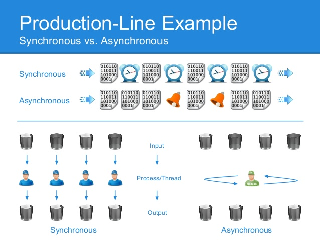
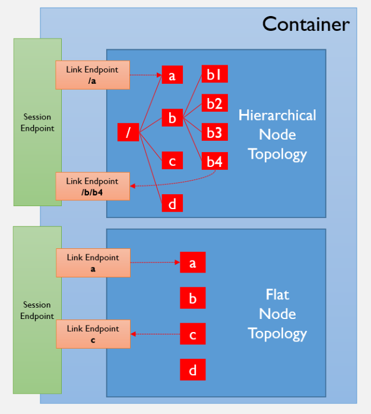
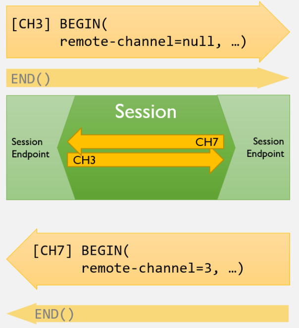
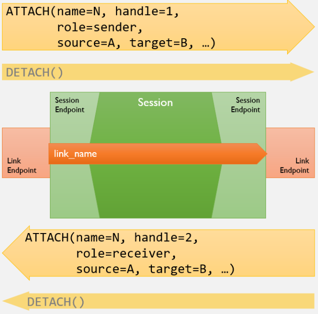
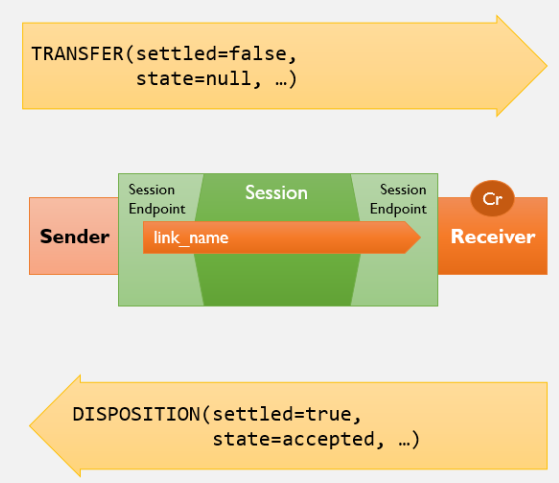
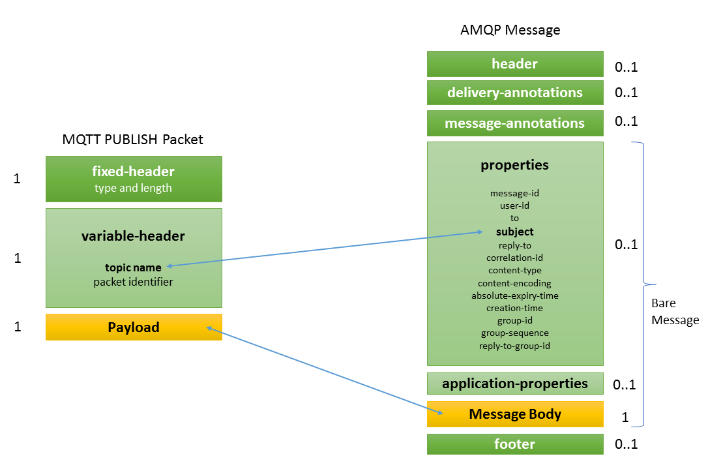

# Message Broker

## Event-Driven Architecture

Die **Even-Driven Architecture** (eventgesteuerte Architektur, kurz EDA) ist ein Softwarearchitekturmodell, das die Kommunikation innerhalb eines Systems beschreibt. Anders als beim "klassischen" Request/Response-Pattern kommunizieren zwei Knoten niemals direkt miteinander, sondern immer über einen Mediator (Vermittler). Dieser Mediator kann z.B. ein Message Broker oder ein Bus sein.

Wie der Name schon sagt, stehen bei der EDA Events im Vordergrund. Ein **Event** (Ereignis) kann letzendlich alles sein, solange es zu einem klar definierten Zeitpunkt geschieht und aufgezeichnet werden kann.

Die Knoten lassen sich in Eventerzeuger und -verbraucher unterteilen, wobei ein und derselbe Rechner sowohl Erzeuger als auch Verbraucher sein kann.

### Vorteile

- Skalierbarkeit
  - Es fällt kaum ins Gewicht, wenn ein weiterer Client ins System eingebunden wird.
- Dezentralisierung
- Asynchronität
  - Viele Prozesse können gleichzeitig laufen und müssen nicht mehr aufeinander warten.
- Anonymität
  - Die Erzeuger und Verbraucher von Events müssen nichts voneinander wissen, weil der Mediator die komplette Kommunikation (und Verarbeitung) übernimmt.

## MQTT

## Beschreibung

**Message Queuing Telemetry Transport** (kurz MQTT) ist ein einfach aufgebautes Publish-Subscribe-Protokoll zum Nachrichtenaustausch im Netzwerk. Es benötigt sehr wenig Bandbreite und Funktion auf den Clients, bietet aber trotzdem eine hohe Zuverlässigkeit bei der Nachrichtenübermittlung. Nachrichten werden in sog. Topics, die man sich wie eine Ordnerstruktur vorstellen kann, einsortiert.

### Topologie 

Das Herzstück von MQTT ist der **Broker**, der die Topics und alle darin enthaltenen Nachrichten verwaltet und den Zugriff der einzelnen Clients auf diese regelt.

Die Clients kommunizieren nie direkt miteinander, sondern immer nur mit dem und über den Broker. Es gibt zwei Arten von Clients im MQTT-Protokoll:

- **Publisher**: Veröffentlicht (regelmäßig) Messdaten o.ä. unter einem bestimmten Topic des Brokers.
- **Subscriber**: Abonniert Topics und bekommt vom Broker daraufhin Nachricht über neue Veröffentlichungen darin.

Es ist durchaus möglich, dass der gleiche Rechner oder Microcontroller sowohl Publisher als auch Subscriber ist.

### Topics

Wie oben schon kurz erwähnt sind Topics wie eine Ordnerstruktur zu verstehen. Die Topics ermöglichen es dem Broker die Nachrichten von den und für die jeweiligen Clients zu gruppieren, zu sortieren und zu filtern.

Topics bestehen jeweils aus einer oder mehreren Ebenen (Level) und diese Ebenen werden durch einen Schrägstrich ("/") getrennt.

#### Wildcards

Um flexibler zu sein und mehrere Topics abonnieren zu können, können die Subscriber Wildcards verwenden.

Das "+"-Zeichen kann **genau ein** Level in der Topic-Hierarchie ersetzen und kann auch mittendrin platziert werden.

Das "#"-Zeichen dagegen muss immer **am Ende** des abonnierten Topics stehen. Der abonnierende Client erhält daraufhin alle Nachrichten der Topics, die so anfangen wie alles vor der Raute. Dabei ist es ganz egal welche oder wie viele Level dahinter noch folgen.

### Ablauf

In der folgenden Grafik ist ein Auszug aus einem Nachrichtenaustausch mit Hilfe des MQTT-Protokoll zu sehen. Die Kommunikation ist hier aus der Sicht des Client A beschrieben, welcher gleichzeitig ein Publisher und Subscriber ist.

Client A verbindet sich zuerst mit dem Broker und abonniert dann das Topic *temperature/roof*. Daraufhin erhält er bis zum Trennen der Verbindung vom Broker die von Client B bislang und in Zukunft unter diesem Topic veröffentlichten Nachrichten.

Zwischendurch veröffentlich Client A selber noch einen Temperaturwert unter dem Topic *temperature/floor*.

### Funktionen

#### QoS - Quality of Service

Je nach Anwendungszweck können einzelne Nachrichten eine sehr unterschiedliche Relevanz haben. Dafür sind im MQTT-Protokoll drei unterschiedliche **Qualities of Service** definiert:

- Bei der der niedrigsten Stufe 0 handelt es sich im Prinzip um eine *fire'n'forget*-Semantik. Es gibt also keine Garantie, dass die Nachricht überhaupt ankommt. 
- Bei QoS-Level 1 ist sichergestellt, dass die Nachricht mindestens einmal in der Topic-Queue landet (*At-least-once*-Semantik). 
- In der höchsten Stufe 2 garantiert der Broker sogar *exactly-once*: die Nachricht wird also genau einmal abgelegt, nicht öfter und nicht weniger

In einem System, wo die Sensoren dauerhaft und sehr viele Messdaten veröffentlichen, würde beispielsweise die Stufe 0 ausreichen. Wenn aber jede einzelne Nachricht für eine Auswertung nötig ist und dementsprechend eine hohe Relevanz hat, dann wird vermutlich Stufe 2 verwendet. 

#### Last will

Der letzte Willen ermöglicht es einem Client beim Verbindungsaufbau eine Nachricht beim Broker zu hinterlegen. Wenn die Verbindung zu diesem Client daraufhin unerwartet getrennt wird, wird diese Nachricht an alle Abonnenten gesendet. Dadurch kann innerhalb eines größeren Systems direkt auf Ausfälle einzelner Geräte reagiert werden.

#### Retained messages

Ein Broker kann so konfiguriert werden, dass die jeweils letzte gesendete Nachricht in einem Topic hinterlegt wird und an einen neuen Subscriber gesendet wird. Das ermöglicht es einem neu verbundenen Client, direkt einen Status (z.B. Messwert) zu erhalten, ohne auf die nächste Nachricht warten zu müssen.

#### Persistent sessions

Mit persistenten Sessions speichert der Broker sich zu jedem Client die abonnierten Topics. Nach einem Abbruch und Wiederaufbau der Verbindung werden diese also direkt wiederhergestellt und alle verpassten Nachrichten in diesen Topics an den Client gesendet. Diese Funktion ist besonders in Umgebungen interessant, in denen mit häufigeren Verbindungsabbrüchen zu rechnen ist.

### Paketstruktur

Ein MQTT-Paket hat eine variable Länge und ist mindestens zwei Bytes lang. In der Grafik und der folgenden Beschreibung gehe ich näher auf den Aufbau ein.

#### Control Header

Der Control Header besteht aus einem Byte und enthält die Informationen über den Nachrichtentyp, den Quality of Service und das Retain-Flag. 

Es gibt folgende Nachrichtentypen:

- CONNECT
- CONNACK
- PUBLISH
- PUBACK
- PUBREC
- PUBREL
- PUBCOMP
- SUBSCRIBE
- SUBACK
- UNSUBSCRIBE
- UNSUBACK
- PINGREQ
- PINGRESP
- DISCONNECT

#### Packet Length

Dieser Teil spezifiziert, wie viele Bytes die restliche Nachricht enthält, und ist selber 1-4 Bytes lang.

#### Variable length Header

Dieser Header enthält das Topic zu dem die Nachricht gehört bzw. gehören soll. Ist also nur vorhanden, wenn zu der Nachricht ein Topic benötigt wird (z.B. bei publish).

#### Payload

Enthält den eigentlichen Inhalt der Nachricht und ist auch nicht bei allen Nachrichtentypen vorhanden.

## AMQP

### Bestandteile

AMQP steht für **Advanced Message Queuing Protocol**.

- **Connection**: Persistente Verbindung zwischen zwei Rechnerknoten (kann mehrere Sessions enthalten)
- **Session**: Sitzung innerhalb der Daten übertragen werden

- **Container**: Anwendung (App), innerhalb der AMQP zur Kommunikation verwendet wird
- **Node**: Addressierbare Entität innerhalb der Anwendung
  - kann alles sein z.B. Topic (wie bei MQTT), Queue
  - können flach, hierarchisch oder als Graph organisiert sein
- **Links**: Dienen der Verbindung zwischen Nodes mittels Pfaden

### Ablauf

##### 1. Verbindungsaufbau

##### 2. Sitzungsaufbau

##### 3. Link erstellen

##### 4. Transfer

## AMQP vs. MQTT

#### Vorteile:

- Höhere Sicherheit 
  - Verschlüsselung mit TLS (Transport Layer Security, Vorgänger SSL) möglich
  - optional Authentifizierung mit SASL (Simple Authentication and Security Layer)
- Flowcontrol

#### Nachteile:

- Komplexität
  - Implementierung
  - Clients
- Overhead

Kurz gesagt: AMQP bietet deutlich mehr Funktionalität als MQTT, ist dadurch aber auch um einiges komplexer und hat mehr Overhead. Im IoT-Umfeld kann das mit schlechten und unzuverlässigen Verbindungen ein ausschlaggebender Faktor sein.

In der Grafik sind die Zusammensetzungen der einzelnen Nachrichtenpakete gegenübergestellt. Eine AMQP-Nachricht kann deutlich mehr (Meta-)Informationen bieten, hat dafür aber - wie erwähnt - auch deutlich mehr Overhead.

## Quellen

Event-Driven Architecture vs. Request/Response: https://realtimeapi.io/hub/event-driven-apis/

Synchron vs. Asynchron: https://www.slideshare.net/hamidreza-s/event-driven-architecture-concepts-in-web-technologies-part-1

Topologie-Grafik: https://www.dataweek.co.za/9101a

Topic-Grafiken: https://www.hivemq.com/blog/mqtt-essentials-part-5-mqtt-topics-best-practices/

Ablauf-Grafik: By Simon A. Eugster - Own work, CC BY-SA 4.0, https://commons.wikimedia.org/w/index.php?curid=70622928

QoS: https://www.heise.de/developer/artikel/Kommunikation-ueber-MQTT-3238975.html

Paketstrutkur: http://www.steves-internet-guide.com/mqtt-protocol-messages-overview/

AMQP: https://onedrive.live.com/view.aspx?resid=123CCD2A7AB10107!732068&ithint=file%2cpptx&lor=shortUrl

AMQP vs. MQTT: https://vasters.com/blog/From-MQTT-to-AMQP-and-back/