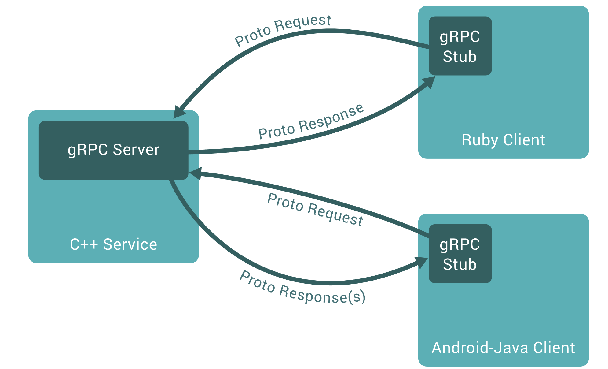
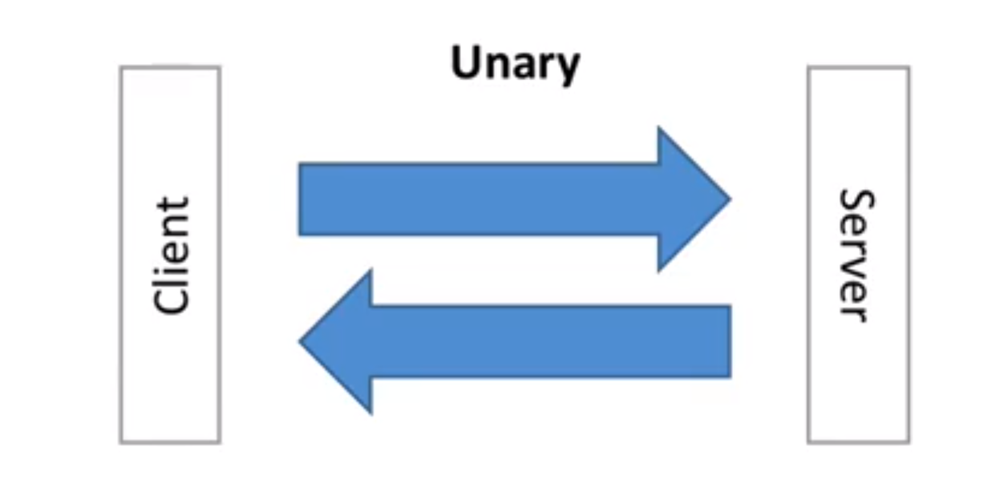
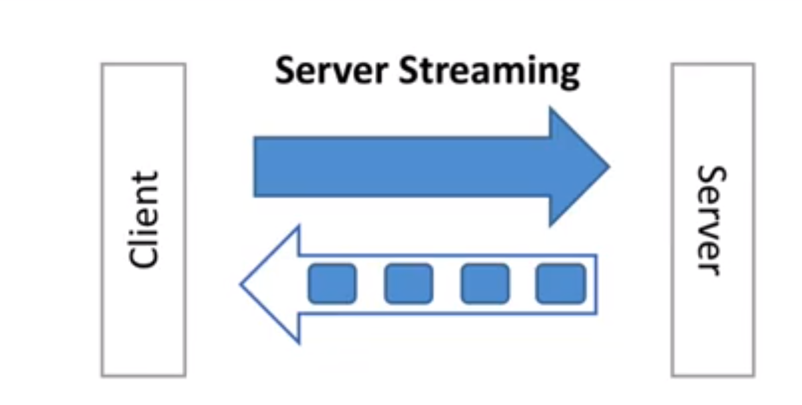
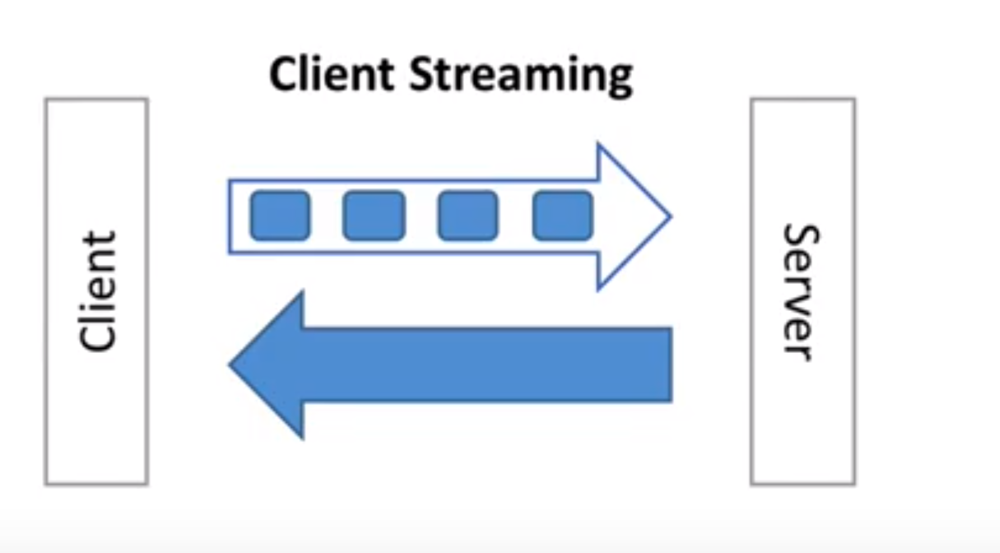

# Kommunikation in Verteilten Systemen

von André Matutat 

## Vorwort
Ein Client basiertes User Interface mit Anbindung an einen Server, welcher die Businesslogik ausführt und einen Datenbankserver im Hintergrund.</br> 
Solche Strukturen sind Alltag in der heutigen Entwicklungszeit, deswegen sollte sich jeder einmal mit den Grundlagen der Kommunikation in verteilten Systemen auseinandersetzten, es schadet aber auch nicht, einen Blick abseits des gängigen Standards zu werfen, da es viele junge, erfolgversprechende, Technologien gibt.</br>

In dieser Dokumentation werden Grundlagen der Kommunikation auf Anwendungsebene erläutert. Es wird kurz auf gängige Praxis eingegangen, danach Folgt der Schwerpunkt dieser Dokumentation GraphQL und danach folgt ein kurzer Überblick auf andere Technologien.</br>

*Anmerkung: Aspekte der (Daten)Sicherheit werden hier nicht behandelt*

## Grundlagen

Ziel jeder Kommunikation ist  die Übermittlung von Daten, dafür benötigt es zwei grundlegende Komponente, Protokolle und Dateiformate.

### Protokolle

Protokoll setzt die Regeln der Kommunikation fest. Es gibt an in welcher Syntax Anfragen und Daten übertragen werden. Protokolle werden nach ihren Aufgabenbereich in Schichten aufgeteilt (s. a. ISO-OSI Modell).

### Dateiformate

Das Dateiformat gibt die Syntax an, wie Daten gespeichert werden müssen.

#### JSON

JSON steht für JavaScript Object Notation und ist ein gängiges Dateiformat, wenn es um die Übertragung von Daten zwischen Server und Webanwendung geht. JSON Files haben den Vorteil, dass sie simpler gehalten und dadurch einfacher zu lesen sind als beispielsweise XML Files.

Ein typisches JSON File könnte in etwa so aussehen:

 ```json
{
    "student": {
  		"id": 012,
  		"name": "Beispiel Student"
        "gebDat": "1990-01-01",
        "Wahlfächer": [
        	"KI",
        	"Full Stack Development",
        	"Kunst"
        ]
    }
}
 ```

In JSON werden Daten wie Objekte formatiert. In diesem Beispiel gibt es einen Studenten, der eine id, einen Namen, ein Geburtsdatum und ein Array mit Wahlfächern hat. 

Auch wenn JSON JavaScript Syntax nutzt, ist es rein Textbasiert und dadurch Sprachen unabhängig. 

## Websockets

Websockets ermöglichen eine anhaltende, bidirektionale Verbindung zwischen Webapplikation und Webserver. <br/>Genau wie beim reinen HTTP, beginnt eine Verbindung zwischen Client und Server mit eine, Handshake, dieser ähnelt den HTTP Upgrade-Header und ist abwärtskompatibel, das ermöglicht die Verwendung von Port 80 und 443  <br/>


Beispiel Client Anfrage:

```
GET /doku HTTP/1.1
Host: beispiel.server.de
Upgrade: websocket
Connection: Upgrade
Sec-WebSocket-Key: x3JJHMbDL1EzLkh9GBhXDw==
Sec-WebSocket-Version: 13
Origin: http://server.de
```

Wie beim HTTP gibt der Client an, auf welche Ressource er zugreifen möchten (/doku), welche HTTP Version verwendet wird und auf welchen Host er sich verbinden will. Außerdem fordert der Client ein Upgrade des Protokolls auf das Websocket Protokoll an. Der Sec-WebSocket-Key dient als Überprüfung, ob der Server die Anfrage wirklich gelesen hat. <br/>

Antwort des Servers:

```
HTTP/1.1 101 Switching Protocols
Upgrade: websocket
Connection: Upgrade
Sec-WebSocket-Accept: HSmrc0sMlYUkAGmm5OPpG2HaGWk=
```
Zuerst folgt die Erklärung, das der Server mit dem Protokoll wechsel einverstanden ist. Der Schlüssel "Sec-WebSocket-Accpet" bestätigt, das der Server die Anfrage des Clients gelesen hat. Er wird mithilfe des übergebenen WebSocket-Keys und den Globally Unique Identifiert generiert.<br/>

Damit eine Verbindung über Websockets überhaupt möglich ist, müssen sowohl Client als auch Server diese unterstützen. Ist die Verbindung hergestellt, können sowohl Client als auch Server diese Verbindung aktiv nutzen. Das ermöglicht beispielsweise, Push Nachrichten des Servers. Dank der bestehenden Verbindung ist kein weiterer HTTP Header nötig, es werden also, im Vergleich zu normalen HTTP, einige Bytes gespart. Websockets sind außerdem statusbehaftete Verbindungen, es kann also auf Cookies o.ä verzichtet werden.<br/>

WebSockets stellen an den Server neue Skalierungsanforderungen. Hält der Server viele Verbindungen mit Clients, welche viele Anfragen stellen, kann es schnell zu Performanz Problemen kommen. Sind die Clients allerdings nur stille Zuhörer, ist die Skalierbarkeit sogar einfacher.

## REST

REST steht für Representational State Transfer und ist der aktuelle Standard zur Datenübertragung in Webbasierten Anwendungen.<br/>Grundkonzept von REST: Alles ist eine Ressource. <br/>Die Funktionalität von REST ähnelt der Funktionalität von Objekten. Der Server implementiert eine REST API, sie stellt Methoden zum Datenaustausch bereit. Der Client ruft diese Methoden auf und übergibt ggf. Parameter. <br/>Ein Beispiel: 

```http
http:\\www.fh-bielefeld.de\stundenplan?fach=informatik
```

  Diese Anfrage besteht aus drei Teilen

- der Domäne, quasi das Objekt
- der Ressource, quasi Methode "Stundenplan"
- der Parameter "fach" mit den Wert "Informatik "

REST verwendet Methoden des HTTP, um den Zugriff auf Daten zu ermöglichen, die wichtigsten Methoden sind:  

| Methode | Beschreibung                 |
| ------- | ---------------------------- |
| GET     | Daten von Server anfordern   |
| POST    | Daten an Server übermitteln  |
| PUT     | Daten auf den Server ändern  |
| DELETE  | Daten auf den Server löschen |

Welche Methode verwendet wird, wird im HTTP Header festgelegt:

```http
POST /shop/products/ HTTP/1.1
Host: www.meinShop.de
Content-Type: application/json

{
  "name": "Kaffee",
  "price": 2.99
}
```

In diesem Beispiel wird ein POST Request gesendet, es werden also Daten an den Server übermittelt. "/shop/products/" gibt die Ressource an, auf die zugegriffen wird. Die Daten werden mittels JSON gespeichert. <br/>Damit eine REST API eine richtige RESTful API ist, müssen noch einige Rahmenbedingungen erfüllt werden, die HATEOAS (**H**ypermedia **A**s **T**he **E**ngine **O**f **A**pplication **S**tate). In der Praxis werden diese Bedingungen nur mangelhaft oder gar nicht erfüllt. Daher spricht man manchmal auch von REST-ish, REST-like oder REST-wannabe Schnittstellen.  

### Nachteile von REST

REST hat mit einigen Limitierungen zu kämpfen. So kommt es unter REST dazu, das mehrere zusammenhängende Abfragen nacheinander gestellt werden müssen und sie nicht gleichzeitig gestellt werden können. Möchte man beispielsweise Informationen über ein Produkt und gleichzeitig über den Hersteller abrufen, werden zwei Anfragen benötigt.<br/>Außerdem ist es unter REST nicht möglich, nur bestimmte Informationen über eine  Ressource abzufragen. Hat ein Hersteller einen Namen, Adresse und ein Gründungsjahr, man möchte aber nur den Namen wissen, bekommt man trotzdem den ganzen Datensatz geliefert, auch Overfetching genannt.  <br/>

## GraphQL	

GraphQL ist eine, von Facebook entwickelte, opensource Abfragesprache, dessen Fokus auf einfache und flexible Benutzung liegt. <br/>

Die Facebook App war Anfangs sehr träge, dies lag aber nicht an der App selber, sondern an der Kommunikation zwischen Backend und App. Facebook hat, dann damit angefangen eine Komplexe REST Schnittstelle zu entwickeln, die unterschiedliche Abfragen zu ließ, daraus entwickelte sich GraphQL.<br/>Grundkonzept von GraphQL ist die Vorstellung, dass Daten als Graf dargestellt werden. Wo REST Ressourcen mithilfe von Verlinkungen miteinander verbindet, werden diese bei GraphQL über Relationen im Grafen miteinander verbunden. Das erlaubt es GraphQL deutlich flexibler zu sein als REST.<br/>

GraphQL ist unabhängig von der Datenbanksoftware und ist in fast jeder Programmiersprache anwendbar(wie Haskell, JavaScript, Python,Ruby, Java, C#, Scala, Go, Elixir, Erlang, PHP, R und Clojure).

__GraphQL Lexikon__ 

| Themen                                                | Kurzbeschreibung                                    |
| ----------------------------------------------------- | --------------------------------------------------- |
| [Standard Abfragen](#Abfragen)                        | Einfache Abfragen von einzelnen Knoten              |
| [Verschachtelte Abfragen](#Abfragen)                  | Abfragen über mehrere Knoten                        |
| [Argumente](#Argumente)                               | Verfeinerung von Abfragen                           |
| [Fragments und Aliase](#Fragments und Aliase)         | Abfragen übersichtlicher Gestalten                  |
| [Variablen](#Variablen)                               | Variable Argumente für Abfragen                     |
| [Richtlinien (Directives)](#Richtlinien (Directives)) | Ermöglichen es, Abfragen dynamisch anzupassen       |
| [Mutation](#Mutation)                                 | Ändern von Daten auf den Server                     |
| [Schemen](#Schema)                                    | Stellt Serverseitig die Datenstruktur zur Verfügung |


### Abfragen

GraphQL Abfragen verwenden immer die HTTP Methode POST und anders als REST, stellt GraphQL Anfragen immer an dieselbe URL.

#### Standard Abfragen

GraphQL bietet den Client besondere Freiheiten, wenn es darum geht seine Abfragen zu gestalten. <br/>Eine einfache Abfrage in GraphQL könnte in etwa so aussehen: 

``` 
query student{
  student {
    id
    name   
  }
}
```
Und so sieht die Antwort JSON aussehen:
```JSON
{
  "data": {
    "student": {
    	"id": 1,
    	"name": "Andre"      
    }
  }
}
```

Abgeändert sieht die Anfrage so aus: 

```
query student{
  student {
    name 
    id
    semester
    gebDat
  }
}
```

Die Antwort:

```JSON
{
  "data": {
    "student": {
    	"name": "Andre",  
    	"id": 1,
    	"gebDat": "1990-01-01",   
    }
  }
}
```

Es gibt also die Möglichkeit, nur die gewünschten Daten abzufragen und diese in der gewählten Reihenfolge zurückzubekommen. Dadurch wird Over- und Underfetching vermieden und der Client weiß ganz genau wie die Antwort aussehen wird.

#### Verschachtelte Abfragen

GraphQLs zweiter großer Vorteil gegenüber REST wird deutlich, wenn man sich ein Beispiel anschaut, welches Abfragen über mehrere Datenknoten ausführt.<br/>Wie bereits im JSON Beispiel gezeigt, hat ein Student Wahlfächer, Wahlfächer haben einen Namen, Creditpoints und einen Dozenten, ein Dozent hat wiederum einen Namen, einen Titel und ein Fachgebiet. <br/>Würde eine RESTful API verwenden werden, müssten mehrere Abfragen gestellt werden, um all diese Daten abfragen zu können. Durch die Verwendung von GraphQL benötigt es nur eine. 

```
query student{
  student{
    id
    name
    wahlfach{
      name
      credits
      dozent {
        name
        titel
        fachgebiet
      }
    }
  }
}
```

Und so würde die Antwort aussehen: 

```JSON
{
  "data": {
    "student": {
    	"id": 1,
    	"name": "Andre",    
        "wahlfach": [
          {
            "name": "KI",
            "credits": 5
            "dozent":{
              "name": "Gips",
              "titel": "Prof. Dr",
              "fachgebiet": "Informatik"
         	 }
          }
           {
            "name": "Full Stack Development",
            "credits": 15
            "dozent":{
              "name": "Brunsmann",
              "titel": "Prof. Dr",
              "fachgebiet": "Informatik"
            }
          }
        ]
    }
  }
}
```

Dadurch, dass nur eine Abfrage gestellt werden muss, nur die Daten geliefert werden, welche wirklich gebraucht werden, wird nicht nur Bandbreite gespart, sondern kann durch die Gewissheit, das Daten in der festgelegten Formatierung ankommen, die Applikation optimiert werden und Performance auf dem Client gespart werden. <br/>

#### Argumente

Es ist auch möglich Abfragen mithilfe von Argumenten zu verfeinern. Existiert eine Liste aller Wahlfächer, es wird aber nur die Informationen über das Wahlfach KI benötigt, dann würden die Anfrage so aussehen: 

```
query wahlfach{
  wahlfach (name:"KI"){    
    credits
  }
}
```

Antwort:

```JSON
{
  "data": {
    "wahlfach": {
    	"credits": 5
    }
  }
}
```

##### Fragments und Aliase

Möchte man zwei Studenten und dessen Wahlfächer abfragen, werden Aliase benötigt. 

```
{
student_one: Student (id: 1){
 	name
    Wahlfach{
        name
    }
  }
  student_two: Student (id: 2){
 	name
    Wahlfach{
        name
    }
  }
}
```

Mithilfe von Fragmenten kann die Abfrage übersichtlicher gestaltet werden.

```
{
    student_one: Student (id: 1){
     	...studFragment
    }
     student_one: Student (id: 2){
     	...studFragment
    }
 }
 fragment studFragment on Student {
     name
     Wahlfach{
         name
     }
 }
```

Die beiden Abfragen sind äquivalent.

##### Variablen

Im obigen Beispiel wurden die Argumente statisch in die Abfrage geschrieben. In der Praxis kommt es aber häufig dazu, dass Abfragen dynamisch gestaltet werden müssen, beispielsweise wenn bestimmte Einstellungen in der UI getätigt werden. <br/>Theoretisch könnte man seine Abfragen dynamisch zusammenbauen, dies würde aber gegen das Konzept der einfachen Implementierung sprechen. Deswegen ist es in GraphQL möglich, Argumente mithilfe von Variablen zu füllen.

```
query wahlfach($WFname: String{
  wahlfach (name: $WFname){    
    credits
  }
}
```

Variable Definition: $WFname repräsentiert die Variable, nach dem Doppelpunkt folgt der Datentyp. <br/>Der Variable muss noch ein Wert zugewiesen werden, dies geschieht innerhalb einer JSON

```JSON
{
  "WFname": "KI"
}
```

An den Server wird sowohl die Query als auch die JSON gesendet. <br/>Standard Parameter können auch festgelegt werden.

```
query wahlfach($WFname: String ="KI"{
  wahlfach (name: $WFname){    
    credits
  }
}
```

#### Richtlinien (Directives)

Variablen ermöglichen es Querys dynamisch anzupassen. Richtlinien ermöglichen es, die Struktur von Querys dynamisch anzupassen.<br/>

```
query wahlfach($WFname: String, $dozent: Boolean!{
  wahlfach (name: $WFname){    
    credits
   	dozent @include (if: %dozent){
      name
      titel
      fachgebiet
   	}
  }
}
```

Im Grunde funktioniert dies genauso wie die Verwendung von Argumenten. Die Informationen über den Dozenten werden nur mitgeliefert, wenn die Variable $dozent in der JSON auf true gesetzt wird. Durch das Ausrufezeichen am Ende des Datentyps, wird übrigens festgelegt, dass die Variable nicht NULL sein darf. Als Gegenstück zu @include existiert auch noch @skip <br/>Eine mögliche dazugehörige JSON.

```JSON
{
  "WFname": "KI",
  "dozent": true
}
```

### Mutationen

Mutationen dienen dazu, Daten auf den Server zu ändern, sie sind also das Äquivalent zum REST POST bzw. UPDATE. Syntaktisch sind sie aufgebaut wie Querys:

```
mutation createDozent($name: String!, $titel: String!, $fachgebiet: String) {
  createDozentOnServer(String: $name, String: $titel, String: $fachgebiet) {  
    titel
  }
}
```

Es gibt auch die Möglichkeit, eine Abfrage in eine Mutation zu integrieren. In diesem Beispiel wird ein Dozent erstellt und es wird danach nach dem Titel unseres Dozenten gefragt. <br/>Dafür wird wieder eine  JSON benötigt, welche die Argumente mit Werten füllt.

```JSON
{
  "name": "Müller",
  "titel": "Dr.",
  "fachgebiet": "Computer Grafik"  
}
```

Antwort vom Server:

```JSON
{
  "data": {
    "createDozentOnServer": {
      "titel": "Dr."
    }
  }
}
```


### Schema 

Das GraphQL Schema wird vom Server bereitgestellt und gibt die Datenstruktur bekannt, es gibt also an, welche Abfragen gestellt werden können und welche Rückgaben erwartet werden sollen. <br/>*Das Schema wird in derselben Sprache geschrieben, wie der GraphQL Services selbst. In dieser Dokumentation nutzen wir eine, von [graphql.github](https://graphql.github.io/learn/schema/) erfundene, GraphQL schema langauge, welche der bisher verwenden Query Language ähnelt* <br/>

Das GraphQL Schema besteht aus einer Auflistung von Typen. <br/>

#### Object Type

Die Basis eines GraphQL Schemas bilden die Objekttypen. Diese sind vergleichbar zu Objekten aus objektorientierten Programmiersprachen. Sie geben an, welche Objekt es gibt und welche Attribute sie besitzen. 

```
type Dozent { 
  name: String!
  titel: String!
  fachgebiet: String!
}

type Wahlfach{
  name: String!
  cp: Int!
  dozent: Dozent!
}

type Student{
  id: ID!
  name: String!
  wahlfach: [Wahlfach!]
}
```

#### Query Type

Neben dem Objekttypen ist auch der Query Typ besonders wichtig. Von diesen besitzt jedes GraphQL Schema nur einen. Der Query Typ bildet alle möglichen Abfragen ab, welche Parameter benötigt werden und welchen Rückgabetyp gesendet werden. Wenn eine Abfrage gestellt wird. Immer wenn eine Query eintritt, dient der Query Typ als Einstiegspunkt in den Objektgrafen. 

```
type Query {
  dozent (name: String!): Dozent
  wahlfach (name: String): Wahlfach[]
  Student (id: ID!): Student
}
```

Es kann also eine Abfrage "dozent" gestellt werden, der bei Bedarf einen String Parameter übergeben wird, die eine Rückgabe vom Typen Dozent bekommt. Wie der Typ Dozent aussieht, kann den Objekttyp "Dozent" entnommen werden. 

#### Mutation

Mutationen sind im GraphQL Schema genauso aufgebaut wie Querys. Technisch gesehen gibt es gar keinen Unterschied zwischen ihnen. Das Klassifizieren einer Query als Mutation dient jede glich dazu, anzugeben das es bei Verwendung dieser Query zu Änderungen an den Daten kommt.

```
type Mutation{
  createDozentOnServer(name: String!, titel: String!, fachgebiet: String!):Dozent!
}
```

#### Subscription Type

GraphQL Subscriptions bieten eine Möglichkeit, das Obeserver Pattern innerhalb seiner GraphQL API umzusetzen. Hierfür reicht es allerdings nicht, einen einfachen Webserver aufzusetzen, es wird ein Server mit Websocket Unterstützung benötigt. <br/>

```
type Subscription {
  newStudent: Student
  }
```

Die Serverseitige Implementation des Subscription Types unterscheidet sich je nach Framework sehr voneinander. Der zugrunde legende Ablauf ähnelt den klassischen vorgehen des Observer Patterns. <br>*In vielen GraphQL Frameworks befinden sich Subscriptions und Websockets noch in der Entwicklung.*


#### Andere

Es gibt noch weitere Typen und Elemente im GraphQL Schema. Eine kurze Auflistung folgt, für weitere Details könnt ihr in den offiziellen [GraphQL Guide](https://graphql.github.io/learn/schema/) schauen. 

| Bezeichnung       | Erläuterung                                                  |
| ----------------- | ------------------------------------------------------------ |
| Scalar Type       | Definieren eigener Datentypen                                |
| Enumeration Types | Definieren von Enums                                         |
| Input Types       | Wie Mutation Types, nur das komplexere Objekte übergeben werden können |
| Interfaces        | Interfaces wie in anderen Sprachen                           |


### Frameworks und Libraries 

Da GraphQL für fast jede Programmiersprache verfügbar ist, gibt es eine Vielzahl an Libraries für die unterschiedlichsten Sprachen und Frameworks. <br/>Eine gute Übersicht für die Serverseitige Implementierung liefert: [Libraries für Serverseitige GraphQL implementation](https://graphql.org/code/) <br/>

- Clientseitige Implementierung
  - Angular: [Apollo](https://www.apollographql.com/docs/angular/)
  - JavaScript: [Vulcan.js](http://vulcanjs.org/)
  - [Übersicht weiterer Frameworks](https://medium.com/open-graphql/exploring-different-graphql-clients-d1bc69de305f)


### Nachteile

Auch wenn GraphQL auf den ersten Blick wie das bessere REST aussieht, hat es auch einige schwächen. <br/>Die große Freiheit der Clients, Abfragen nach Bedarf zu formen, kann zu hohen Performance Problemen auf den Backend führen. Serverseitig muss man also ein besonderes Augenmerk auf die Performance legen. <br/>

GraphQL hat auch noch mit einigen Kinderkrankheiten zu kämpfen, so gibt es noch keine native Lösung zur Handhabung von Authentifizierungen und natives HTTP Caching ist nicht möglich. Da das Schema nach außen Bekannt gegeben wird, gibt man auch so die Datenstruktur der Applikation preis. <br/>

### Zusammenfassung

GraphQL ist ein Abfragen Sprache, die besonderen Fokus auf flexible Clientseitige Entwicklung legt. Ziel ist es den Client Daten in der von ihm gewünschten Formatierung zu übergeben und dabei Over- und Underfetching zu verhindern. Im Vergleich zu REST werden sowohl Rechenleistung des Clients geschont als auch die Abfragen Anzahl reduziert, das ist vor allem für Mobile Applikationen interessant.<br/>

  Der Server stellt ein GraphQL Schema zur Verfügung und gibt dadurch die Datenstruktur bekannt. So weiß der Client, welche Querys er stellen kann, um Daten abzufragen.

Das folgende Schaubild zeigt einen möglichen Aufbau eines GraphQL Systems:  


### GraphQL vs REST

Jetzt stellt sich die Frage, was sollte man benutzen, REST oder GraphQL? Und die Antwort ist..... es kommt drauf an. Beide Technologien haben ihre Vor- und Nachteile und von daher muss man schauen, welche Anforderungen die API erfüllen muss. Evtl. ist auch eine Kombination von REST und GraphQL zielführend. <br/>

Einen guten Anhaltspunkt liefert die Fragenliste von [Phil Sturgeon](https://philsturgeon.uk/api/2017/01/24/graphql-vs-rest-overview) 

- Wie groß ist der Unterschied der einzelnen Clients?
- Vertraust du den Clients zu, selbstständig zu Cachen?
- Willst du lieber Dumme Clients, welche sehr wenig über die API wissen oder lieber schlaue Clients die viel Logik und ein größeres Verständnis der API haben?
- Ist es in Ordnung, wenn HTTP-Debugging-Proxys, Cache-Proxies und all das Wissen, das dein Team rund um HTTP usw. hat, wegfällt?
- Verwendest du nur einfaches CRUD mit simplen JSOM Dokumente oder braucht deine API File Upload und download?


## gRPC

gRPC ist ein, von Google entwickeltes, RPC Framework. </br>

### Was ist RPC?

RPC steht für Remote Procedure Call und dient als Programmierschnittstelle um Prozesse auf entfernten Geräten zu starten. Idee ist es, Methoden und Funktionen vom Client auf einen Server auszulagern. <br/>Der Client sendet eine Rad-Nachricht an den Server. Der Server empfängt diese Rad-Nachricht, liest die Daten über die Anwendung aus und leitet sie dann, an die jeweilige Server Anwendung weiter. Die Server Anwendung bearbeitet die Anfrage und schickt das Ergebnis an den Client zurück.




Man unterscheidet grundlegend zwischen Synchronen und A-Synchronen RPC Anfragen. <br/>Bei Synchronen Anfragen muss der Client auf die Antwort des Servers warten und darf keine weiteren Aufgaben erledigen. Bei A-Synchronen Anfragen, ist es den Client möglich, weitere Operationen durchzuführen. <br/>

RPC-Server müssen ihren Service definieren. In der Service Definition steht, welche Methoden der Client Aufrufen kann und welch Rückgabe er zu erwarten hat. 

### Google RPC

gRPC ist ein RPC Framework, welches full duplex streaming erlaubt. Das ermöglicht grundlegend vier Arten von Schnittstellen mit gRPC.

#### Unary



Die klassische Client-Server Architektur. Der Client sendet eine Anfrage und der Server sendet eine Antwort.

#### Server Streaming



Beim Server Streaming, sendet der Client eine Anfrage und der Server antwortet mit einem Stream. Mithilfe dieses Streams kann der Server mehrere Antworten in beliebiger Zeit verschicken.

#### Client Streaming



Hier stellt der Client eine Anfrage Stream und kann mehrere Anfragen in beliebiger Zeit verschicken.

#### Bi Directional Streaming


Beim Bi Directional Streaming sendet der Client einen Anfrage Stream und der Server antwortet mit einem Stream.

### Anwendungen

gRPC befindet sich derzeit noch in Enwicklung, aber bereits viele große Firmen wie [Square](https://corner.squareup.com/2015/02/grpc.html), [Netflix](https://github.com/Netflix/ribbon), [CoreOS](https://blog.gopheracademy.com/advent-2015/etcd-distributed-key-value-store-with-grpc-http2/), [Docker](https://blog.docker.com/2015/12/containerd-daemon-to-control-runc/), [CockroachDB](https://github.com/cockroachdb/cockroach), [Cisco](https://github.com/CiscoDevNet/grpc-getting-started), [Juniper Networks](https://github.com/Juniper/open-nti) verwenden gRPC. 


## QUIC und HTTP 3

QUIC ist ein, von Google entwickeltes, Netzwerkprotokoll, welches mit dem Ziel entwickelt wurde, den Datenverkehr im Internet erheblich zu beschleunigen. Das aktuell noch in Entwicklung befindliche HTTP 3 wird QUIC verwenden. <br/>
QUIC basiert im Gegenzug zu HTTP 2 nicht mehr auf TCP, sondern auf den verbindungslosen UDP. Durch den Verzicht von TCP fallen viele notwendige Funktionen raus. UDP ist nicht in der Lage Paketverlust zu beheben und hat auch keinerlei Überlastkontrolle. Diese durchaus wichtigen Funktionen werden jetzt von QUIC übernommen. 


Um den Paketverlust zu beheben, bedient sich QUIC der Vorwärts Fehlerkorrektur. Durch ein einfaches XOR-basierten Fehlerkorrektursystems ist keine erneute Übertragung der verlorenen Daten nötig. Diese werden mithilfe von Forward Error Correction (FEC) Paketen rekonstruiert.<br/>

QUIC liefert zudem noch viele andere Features wie:

- Multiplexing, Server müssen Anfragen nicht mehr sequenziell abarbeiten und können Datenpakete Priorisieren
- Verschlüsselung: QUIC verwendet zwingend TLS 1.3, dadurch geben HTTP Header deutlich weniger META-Daten bekannt
- Roaming: Pakete werden nicht anhand einer IP-Adresse zugeordnet, sondern anhand einer 64Bit langen UUID. Das erlaubt es, während einer Verbindung die IP-Adresse zu ändern (z. B. vom WLAN zum Mobilen Netz)

*TLS in einfach: Es gibt zwei Header, der erste wird bei dem Aufbau einer ERSTMALIGEN Verbindung benutzt. Client und Server verifizieren sich und einigen sich auf einen Schlüssel. Danach wird bei jeder Verbindung der zweite Header verwendet.* <br/>Durch den Verzicht auf das TCP, fallt auch der dazugehörige TCP-Handshake weg, dadurch können Applikationsdaten schon beim ersten Paket verschickt werden. <br/>Eine durchschnittliche TCP+TLS Verbindung benötigt 6 Pakete, bevor es zur Datenübertragung kommt, mit QUIC braucht es unter Umständen gar kein Paket, je nachdem ob eine Verbindung bekannt ist oder nicht.

 

**Zusammengefasst kann man sagen: QUIC ist schneller und sicherer als aktuell herkömmliche Verbindungsarten.**

Da sich QUIC noch in der Entwicklung befindet, findet es überwiegend Anwendung in Google Services, wie google.com, Google Drive, Google Photos etc.

### Nachteile

QUIC wurde mit besonderen Fokus auf Sicherheit entwickelt, durch die starke und umfangreiche Verschlüsselung der Header, werden Aufgaben wie: Fehlerbehebung, Traffic-Regulierung oder Netzwerk-Management erschwert. <br/>Außerdem ist das verwendete Verfahren zur Datenwiederherstellung nur dann möglich, wenn nicht mehrere Daten einer Datengruppe fehlen.

## Quellen
- [Grundlagen Netzwerkprotokolle](https://de.wikipedia.org/wiki/Netzwerkprotokoll)
- [Grundlagen JSON](https://www.w3schools.com/js/js_json_intro.asp)
- [Websockets Wikipedia](https://en.wikipedia.org/wiki/WebSocket)
- [HTTP Upgrade Header](https://en.wikipedia.org/wiki/HTTP/1.1_Upgrade_header)
- [WebSockets Grafik](https://www.pubnub.com/websockets/)
- [Grundlagen REST](http://www.codeadventurer.de/?p=3228)
- [GraphQL Wikipedia](https://de.wikipedia.org/wiki/GraphQL)
- [GraphQL Guide mit interaktiven Beispielen](https://graphql.github.io/learn/)
- [GraphQL Schema Guide](https://www.oreilly.com/library/view/learning-graphql/9781492030706/ch04.html)
- [REST vs GraphQL](https://philsturgeon.uk/api/2017/01/24/graphql-vs-rest-overview/)
- [QUIC Wikipedia](https://de.wikipedia.org/wiki/Quick_UDP_Internet_Connections)
- [QUIC Elektronik-Kompendium](https://www.elektronik-kompendium.de/sites/net/2210241.htm)
- [QUIC im Überblick](https://medium.com/@codavel/quic-vs-tcp-tls-and-why-quic-is-not-the-next-big-thing-d4ef59143efd)
- [TLS Wikipedia](https://de.wikipedia.org/wiki/Transport_Layer_Security)
- [HTTP 3 nutzt QUIC](https://www.golem.de/news/ietf-http-ueber-quic-wird-zu-http-3-1811-137655.html)
- [QUIC vs TCP gif](https://cloudplatform.googleblog.com/2018/06/Introducing-QUIC-support-for-HTTPS-load-balancing.html)
- [GRPC](https://grpc.io/)
