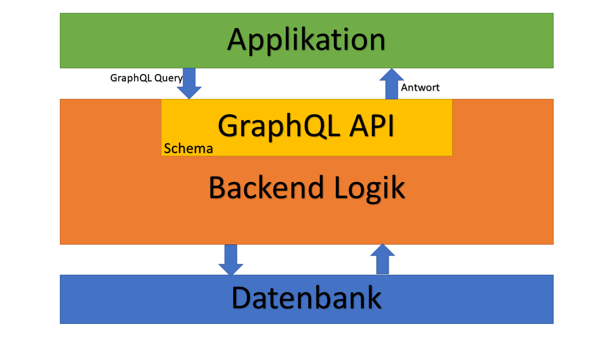
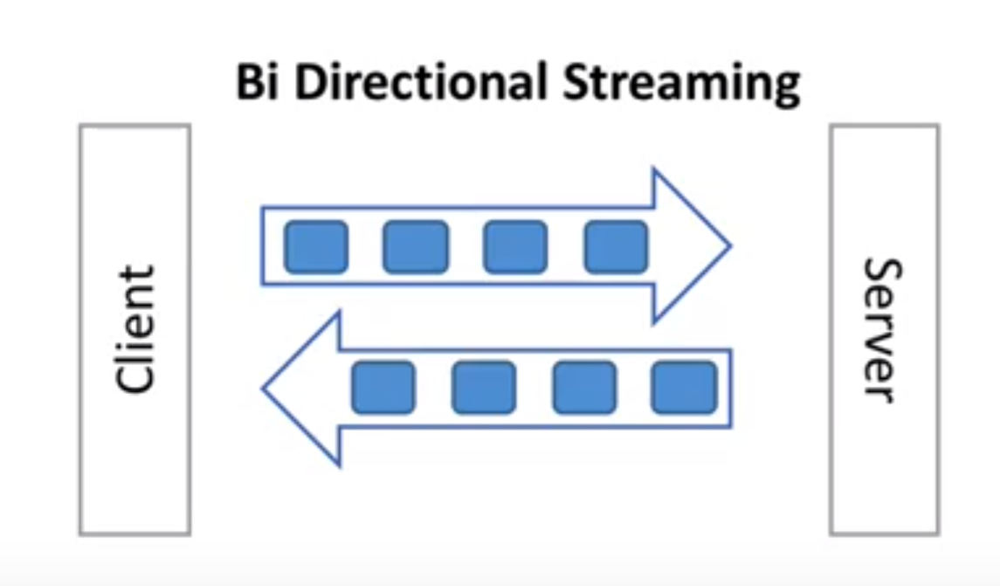
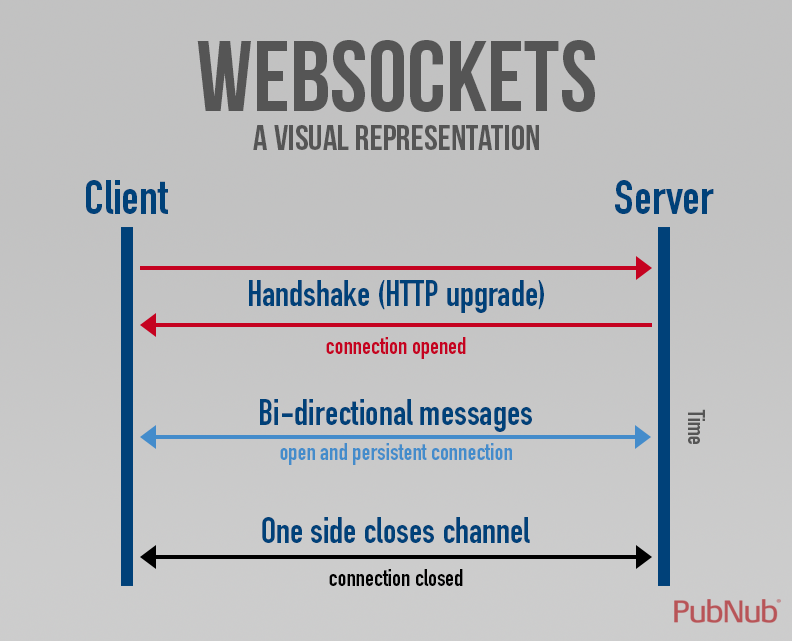
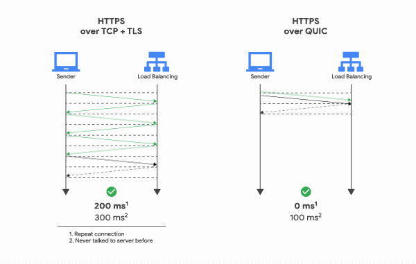

# Kommunikation in Verteilten Systemen

von André Matutat 

## Vorwort
Ein Clientbasiertes User Interface mit Anbindung an einen Server, welcher die Business Logik ausführt und einen Datenbankserver im Hintergrund.</br> 
Solche Strukturen sind Alltag in der heutigen Entwicklungszeit, deswegen sollte sich jeder einmal mit den Grundlagen der Kommunikation in verteilten Systemen auseinandersetzten, es schadet aber auch nicht, einen Blick abseits des gängigen Standards zu werfen, da es viele junge Technologien gibt. </br>

In dieser Dokumentation möchte ich Grundlagen der Kommunikation auf Anwendungsebene erläutern. Ich werde kurz auf gängige Praxis eingehen, den Fokus aber auf GraphQL legen. </br>

*Anmerkung: Aspekte der Sicherheit werden hier nicht behandelt*

## Grundlagen

Ziel jeder Kommunikation ist  die Übermittlung von Daten, dafür brauchen wir zwei grundlegende Komponente, das Protokoll und das Dateiformat.

### Protokolle

Das Protokoll setzt die Regeln der Kommunikation fest. Es gibt an in welcher Syntax Anfragen und Daten übertragen werden. 

### Dateiformate

Das Dateiformat gibt die Syntax an, wie Daten gespeichert werden müssen. Daraus folgt auch, wie mit den Daten gearbeitet werden kann. 

#### JSON

JSON steht für JavaScript Object Notation und ist ein gängiges Dateiformat, wenn es um die Übertragung von Daten zwischen Server und Webanwendung geht. JSON Files haben den Vorteil, dass sie simpler gehalten und dadurch einfacher zu lesen sind als beispielsweise XML.

Ein typisches JSON File könnte in etwa so aussehen  :

 ```json
{
    "student": {
  		"id": 012,
  		"name": "Beispiel Student"
        "gebDat": "1990-01-01",
        "Wahlfächer": [
        	"KI",
        	"Full Stack Development",
        	"Kunst"
        ]
    }
}
 ```

Im Grunde werden Daten in JSON wie Objekte formatiert. In diesem Beispiel haben wir einen Studenten, der eine id, einen Namen, ein Geburtsdatum und ein Array mit Wahlfächern hat. 

Auch wenn JSON JavaScript Syntax nutzt, ist es rein Textbasiert und dadurch Sprachen unabhängig. 


## REST

REST steht für Representational State Transfer und ist ein aktueller Standard zur Datenübertragung in Webbasierten Anwendungen.<br/>Grundkonzept von REST: Alles ist eine Ressource <br/>Die Funktionalität von REST kann man sich ähnlich vorstellen wie die Funktionalität von Objekten in Java. Der Server implementiert eine RESTful API, sie stellt Methoden zum Datenaustausch bereit. Der Client ruft diese Methoden auf und übergibt ggf. Parameter. <br/>Machen wir ein Beispiel: 

```http
http:\\www.fh-bielefeld.de\stundenplan?fach=informatik
```

Diese Anfrage besteht aus drei Teilen

- der Domäne, quasi das Java Objekt 
- der Ressource, quasi Methode "Stundenplan"
- der Parameter "fach" mit den Wert "Informatik "


REST verwendet Methoden des HTTP um den Zugriff auf Daten zu ermöglichen, die wichtigsten Methoden sind: 

| Methode | Beschreibung                 |
| ------- | ---------------------------- |
| GET     | Daten von Server anfordern   |
| POST    | Daten an Server übermitteln  |
| PUT     | Daten auf den Server ändern  |
| DELETE  | Daten auf den Server löschen |

Welche Methode verwendet wird, legen wir im HTTP Header fest:

```http
POST /shop/products/ HTTP/1.1
Host: www.meinShop.de
Content-Type: application/json

{
  "name": "Kaffee",
  "price": 2.99
}
```

In diesem Beispiel senden wir einen POST Request, also übermitteln wir Daten an den Server. "/shop/products/" gibt die Ressource an auf die wir zugreifen. Die Daten übermitteln wir hier mittels JSON.  <br/>Damit eine REST API eine richtige REST API ist, müssen noch einige Rahmenbedingungen erfüllt werden, die HATEOAS. In der Praxis werden diese Bedingungen nur mangelhaft oder gar nicht erfüllt. Daher spricht man manchmal auch von REST-ish, REST-like oder REST-wannabe.  

### Nachteile von REST

REST hat auch mit einigen Limitierungen zu kämpfen. So kommt es unter REST oft dazu, das man mehrere zusammenhängende Abfragen nacheinander stellen muss und sie nicht gleichzeitig stellen kann.  Möchte man beispielsweise Informationen über ein Produkt und gleichzeitig über den Hersteller abrufen, muss man zwei Anfragen stellen. Bei größeren Datenmenge, kann dies ganz schön langsam sein.<br/>Außerdem ist es unter REST nicht möglich nur bestimmte Informationen über eine  Ressource abzufragen. Hat ein Hersteller also einen Namen, Adresse und ein Gründungsjahr, wir wollen aber nur den Namen wissen, bekommen wir trotzdem den ganzen Datensatz geliefert, auch Overfetching genannt.  <br/>

## GraphQL	

GraphQL ist eine, von Facebook entwickelte, opensource Abfragesprache, dessen Fokus auf einfache und flexible Benutzung liegt. <br/>

Die Facebook App war Anfangs sehr träge, dies lag aber nicht an der App selber, sondern an der Kommunikation zwischen Backend und App. Facebook hat dann damit angefangen eine Komplexe REST Schnittstelle zu entwickeln die unterschiedliche Abfragen zu lies, daraus entwickelte sich GraphQL.<br/>Grundkonzept von GraphQL ist die Vorstellung, dass Daten als Graf dargestellt werden. Wo REST Resourcen mithilfe von Verlinkungen miteinander verbindet, werden diese bei GraphQL über Relationen im Grafen miteinander verbunden. Das erlaubt es GraphQL deutlich flexibler zu sein als REST.<br/>

GraphQL ist unabhängig von der Datenbanksoftware und ist in fast jeder Programmiersprache anwendbar(wie Haskell, JavaScript, Python,Ruby, Java, C#, Scala, Go, Elixir, Erlang, PHP, R und Clojure).

__GraphQL Lexikon__ 

| Themen                                   | Kurzbeschreibugn                         |
| ---------------------------------------- | ---------------------------------------- |
| [Standard Abfragen](#Abfragen)           | Einfache Abfragen von einzelnen Knoten   |
| [Verschachtelte Abfragen](#Abfragen)     | Abfragen über mehrere Knoten             |
| [Argumente](#Argumente)                  | Verfeinerung von Abfragen                |
| [Variablen](#Variablen)                  | Variable Argumente für Abfragen          |
| [Richtlinien (Directives)](#Richtlinien (Directives)) | Ermöglichen es, Abfragen dynamisch anzupassen |
| [Mutation](#Mutation)                    | Ändern von Daten auf den Server          |
| [Schemen](#Schema)                       | Stellt Serverseitig die Datenstruktur zur Verfügung |
| [Validation](#Validation)                | Überprüfen der Gültigkeit von Querys     |


### Abfragen

GraphQL Abfragen verwenden immer die HTTP Methode POST und anders als REST, stellt GraphQL Anfragen immer an dieselbe URL.

#### Standard Abfragen

GraphQL bietet den Client besondere Freiheiten, wenn es darum geht seine Abfragen zu gestalten. <br/>Eine einfache Abfrage in GraphQL könnte in etwa so aussehen: 

``` 
query student{
  student {
    id
    name   
  }
}
```
Und so könnte die Antwort JSON aussehen:
```JSON
{
  "data": {
    "student": {
    	"id": 1,
    	"name": "Andre"      
    }
  }
}
```

Ändern wir die Anfrage etwas ab, könnte sie so aussehen: 

```
query student{
  student {
    name 
    id
    semester
    gebDat
  }
}
```

Die Antwort:

```JSON
{
  "data": {
    "student": {
    	"name": "Andre",  
    	"id": 1,
    	"gebDat": "1990-01-01",   
    }
  }
}
```

Wir haben also die Möglichkeit, nur die gewünschten Daten abzufragen und diese in der von uns gewählten Reihenfolge zurück zu bekommen. Dadurch wird Over- und Underfetching vermieden und der Client weiß ganz genau wie die Antwort aussehen wird. 

#### Verschachtelte Abfragen

GraphQLs zweiter großer Vorteil gegenüber REST wird deutlich, wenn wir uns ein Beispiel anschauen, welches Abfragen über mehrere Datenknoten ausführt.<br/>Wie bereits im JSON Beispiel gezeigt, hat ein Student Wahlfächer, Wahlfächer haben einen Namen, Creditpoints und einen Dozenten, ein Dozent hat wiederum einen Namen, einen Titel und ein Fachgebiet. <br/>Würden wir eine RESTful API verwenden, müssten wir mehrere Abfragen stellen, um all diese Daten abfragen zu können. Durch die Verwendung von GraphQL brauchen wir nur eine: 

```
query student{
  student{
    id
    name
    wahlfach{
      name
      credits
      dozent {
        name
        titel
        fachgebiet
      }
    }
  }
}
```

Und so würde die Antwort aussehen: 

```JSON
{
  "data": {
    "student": {
    	"id": 1,
    	"name": "Andre",    
        "wahlfach": [
          {
            "name": "KI",
            "credits": 5
            "dozent":{
              "name": "Gips",
              "titel": "Prof. Dr",
              "fachgebiet": "Informatik"
         	 }
          }
           {
            "name": "Full Stack Development",
            "credits": 15
            "dozent":{
              "name": "Brunsmann",
              "titel": "Prof. Dr",
              "fachgebiet": "Informatik"
            }
          }
        ]
    }
  }
}
```

Dadurch, dass wir nur eine Abfrage stellen brauchen, nur die Daten bekommen, welche wir wirklich brauchen sparren wir nicht nur Bandbreite sondern können durch die Gewissheit, das Daten in der von uns gewünschten Formatierung ankommen, unsere Applikation optimieren und so Performance auf der Client Seite sparen. <br/>

#### Argumente

Natürlich ist es auch möglich, Abfragen mithilfe von Argumenten zu verfeinern. Haben wir eine Liste aller Wahlfächer, brauchen aber nur die Informationen über das Wahlfach KI, dann würden unsere Anfrage so aussehen: 

```
query wahlfach{
  wahlfach (name:"KI"){    
    credits
  }
}
```

Antwort:

```JSON
{
  "data": {
    "wahlfach": {
    	"credits": 5
    }
  }
}
```

##### Fragments und Aliase

Gehen wir davon aus, wir möchten zwei Studenten und dessen Wahlfächer abfragen. Das können wir mithilfe von Aliase machen.

```
{
student_one: Student (id: 1){
 	name, 
    Wahlfach{
        name
    }
  }
  student_two: Student (id: 2){
 	name, 
    Wahlfach{
        name
    }
  }
}
```

Mithilfe von Fragmenten können wir die Abfrage noch etwas übersichtlicher gestalten.

```
{
    student_one: Student (id: 1){
     	...studFragment
    }
     student_one: Student (id: 2){
     	...studFragment
    }
 }
 fragment studFragment on Student {
     name,
     Wahlfach{
         name
     }
 }
```

Die beiden Abfragen sind äquivalent.


##### Variabeln

Im obigen Beispiel haben wir unsere Argumente statisch in die Abfrage geschrieben. In der Praxis kommt es aber häufig dazu, dass wir Abfragen dynamisch gestalten müssen, beispielsweise wenn bestimmte Einstellungen in der UI getätigt werden. <br/>Theoretisch könnte man seine Abfragen natürlich dynamisch zusammenbauen, dies würde aber gegen das Konzept der einfachen Implementierung sprechen. Deswegen ist es in GraphQL möglich, Argumente mithilfe von Variablen zu füllen.

```
query wahlfach($WFname: String{
  wahlfach (name: $WFname){    
    credits
  }
}
```

Variable Definition: $WFname repräsentiert die Variable, nach den Doppelpunkt folgt der Datentyp. <br/>Natürlich müssen wir unsere Variable noch einen Wert zuweisen, dies machen wir mithilfe einer JSON

```JSON
{
  "WFname": "KI"
}
```

An den Server senden wir sowohl die Query als auch die JSON. <br/>Wir können bei Bedarf auch Standard Variablen festlegen.

```
query wahlfach($WFname: String ="KI"{
  wahlfach (name: $WFname){    
    credits
  }
}
```

#### Richtlinien (Directives)

Variablen ermöglichen es Querys dynamisch anzupassen. Richtlinien ermöglichen es uns, die Struktur von Querys dynamisch anzupassen.<br/>

```
query wahlfach($WFname: String, $dozent: Boolean!{
  wahlfach (name: $WFname){    
    credits
   	dozent @include (if: %dozent){
      name
      titel
      fachgebiet
   	}
  }
}
```

Im Grunde funktioniert dies genauso wie die Verwendung von Argumenten. Die Informationen über den Dozenten werden nur mitgeliefert, wenn die Variable $dozent in der JSON auf true gesetzt wird. Durch das Ausrufezeichen am Ende des Datentyps, legen wir übrigens fest, dass die Variable nicht NULL sein darf. Als Gegenstück zu @include existiert auch noch @skip<br/>Zur Vollständigkeit, eine mögliche dazugehörige JSON 

```JSON
{
  "WFname": "KI",
  "dozent": true
}
```

### Mutationen

Mutationen dienen dazu, Daten auf den Server zu ändern, sie sind also das Äquivalent zum REST POST bzw. UPDATE. Syntaktisch sind sie genauso aufgebaut wie Querys:

```
mutation createDozent($name: String!, $titel: String!, $fachgebiet: String) {
  createDozentOnServer(String: $name, String: $titel, String: $fachgebiet) {  
    titel
  }
}
```

Wir übergeben in unserer Mutation(!) wieder unterschiedliche Parameter an die Server Methode "createDozentOnServer". Wir haben auch die Möglichkeit, eine Abfrage in eine Mutation zu integrieren. In diesem Beispiel erstellen wir also einen Dozenten und Fragen danach den Titel unseres Dozenten ab. <br/>Dafür brauchen wir wieder eine JSON, welche unsere Argumente mit Werten füllt:

```JSON
{
  "name": "Müller",
  "titel": "Dr.",
  "fachgebiet": "Computer Grafik"  
}
```

Antwort vom Server:

```JSON
{
  "data": {
    "createDozentOnServer": {
      "titel": "Dr."
    }
  }
}
```


### Schema 

Das GraphQL Schema wird vom Server bereitgestellt und gibt die Datenstruktur bekannt, es gibt also an, welche Abfragen wir stellen können und welche Rückgaben wir erwarten können. <br/>*Das Schema wird in derselben Sprache geschrieben, wie der GraphQL Services selbst. In dieser Dokumentation nutzen wir eine, von [graphql.github](https://graphql.github.io/learn/schema/) erfundene, GraphQL schema langauge, welche unserer bisher verwenden Query Language ähnelt* <br/>

Im Grunde besteht unser GraphQL Schema aus einer Auflistung all unserer Typen. <br/>

#### Object types

Die Basis eines GraphQL Schemas bilden die Objekttypen. Dise sind vergleichbar zu Objekten aus objektorientierten Programmiersprachen. Sie geben an, welche Objekt es gibt und welche Attribute sie besitzen. Die Typen in unserem Schema könnten in etwa so aussehen: 

```
type Dozent { 
  name: String!
  titel: String!
  fachgebiet: String!
}

type Wahlfach{
  name: String!
  cp: Int!
  dozent: Dozent!
}

type Student{
  id: ID!
  name: String!
  wahlfach: [Wahlfach!]
}
```

#### Query types

Neben dem Objekttypen ist auch der Query Typ besonders wichtig. Von diesen besitzt jedes GraphQL Schema nur einen. Der Query Typ bildet alle möglichen Abfragen ab, welche Parameter benötigt werden und welchen Rückgabetyp wir bekommen, wenn wir eine Abfrage stellen. Immer wenn eine Query eintritt, dient der Query Typ als Einstiegspunkt in den Objektgrafen. Für unsere Studenten Beispiel würde der Query Typ in etwa wie folgt aussehen:

```
type Query {
  dozent (name: String!): Dozent
  wahlfach (name: String): Wahlfach[]
  Student (id: ID!): Student
}
```

Wir können also eine Abfrage "dozent" stellen, der wir bei Bedarf einen String Parameter übergeben, die uns eine Rückgabe vom Typen Dozent gibt, wie der Typ Dozent aussieht, können wir den Objekttyp "Dozent" entnehmen. 

#### Mutation types

Mutationen sind im GraphQL Schema genauso aufgebaut wie Querys. Technisch gesehen gibt es gar keinen Unterschied zwischen ihnen. Das Klassifizieren einer Query als Mutation dient jede glich dazu, anzugeben das es bei Verwendung dieser Query zu Änderungen an den Daten kommt.

```
type Mutation{
  createDozentOnServer(name: String!, titel: String!, fachgebiet: String!):Dozent!
}
```

#### Andere

Es gibt noch weitere Typen und Elemente im GraphQL Schema. Eine kurze Auflistung folgt, für weitere Details in den offiziellen [GraphQL Guide](https://graphql.github.io/learn/schema/) schauen. 

| Bezeichnung       | Erläuterung                              |
| ----------------- | ---------------------------------------- |
| Scalar Type       | Definieren eigener Datentypen            |
| Enumeration types | Definieren von Enums                     |
| Input types       | Wie Mutation types, nur das komplexere Objekte übergeben werden können |
| Interfaces        | Interfaces wie in anderen Sprachen       |

### Validation

Durch das Typesystem kann die Gültigkeit einer Query bereits überprüft werden ohne diese Auszuführen. Dadurch können sowohl Server auch als Client den Entwickler über ungültige Querys informieren.

### Frameworks und Libraries 

Da GraphQL für fast jede Programmiersprache verfügbar ist, gibt es eine Vielzahl an Libraries für die unterschiedlichsten Sprachen und Frameworks. <br/>Eine gute Übersicht für die Serverseitige Implementierung liefert: [Libraries für Serverseitige GraphQL implementation](https://graphql.org/code/) <br/>

- Clientseitige Implementierung
  - Angular: [Apollo](https://www.apollographql.com/docs/angular/)
  - JavaScript: [Vulcan.js](http://vulcanjs.org/)
  - [Übersicht weiterer Frameworks](https://medium.com/open-graphql/exploring-different-graphql-clients-d1bc69de305f)


### Nachteile

Auch wenn GraphQL auf den ersten Blick wie das bessere REST aussieht, hat es aber auch einige schwächen. <br/>Die große Freiheit der Clients, Abfragen nach Bedarf zu formen, kann zu hohen Performance Problemen auf den Backend führen. Serverseitig muss man also ein besonderes Augenmerk auf die Performance legen. <br/>

GraphQL hat aber auch noch mit einigen Kinderkrankheiten zu kämpfen, so gibt es noch keine native Lösung zur Handhabung von Authentifizierungen und natives HTTP Caching ist nicht möglich. Da das Schema nach außen Bekannt gegeben wird, gibt man auch so die Datenstruktur der Applikation preis. <br/>

### Zusammenfassung

GraphQL ist ein Abfragen Sprache die besonderen Fokus auf flexible Clientseitige Entwicklung legt. Ziel ist es den Client Daten in der von ihm gewünschten Formatierung zu übergeben und dabei Over- und Underfetching zu verhindern. Im Vergleich zu REST werden sowohl Rechenleistung des Clients geschohnt als auch die Abfragen Anzahl reduziert, das ist vor allem für Mobile Applikationen interessant.<br/>

Der Server stellt ein GraphQL Schema zur Verfügung und gibt dadurch die Datenstruktur bekannt. So weiß der Client, welche Querys er stellen kann um Daten abzufragen.

Das folgende Schaubild zeigt einen möglichen Aufbau eines GraphQL Systems: 




### GraphQL vs REST

Jetzt stellt sich die Frage, was sollen wir benutzen, REST oder GraphQL? Und die Antwort ist..... es kommt drauf an. Beide Technologien haben ihre Vor- und Nachteile und von daher müssen wir schauen, welche Anforderungen unsere API erfüllen muss. Evtl. ist auch eine Kombination von REST und GraphQL zielführend. <br/>

Einen guten Anhaltspunkt liefert die Fragenliste von [Phil Sturgeon](https://philsturgeon.uk/api/2017/01/24/graphql-vs-rest-overview) 

- Wie groß ist der Unterschied der einzelnen Clients?
- Vertraust du den Clients zu, selbstständig zu Cachen?
- Willst du lieber Dumme Clients, welche sehr wenig über die API wissen oder lieber schlaue Clients die viel Logik und ein größeres Verständnis der API haben?
- Ist es in Ordnung, wenn HTTP-Debugging-Proxys, Cache-Proxies und all das Wissen, das dein Team rund um HTTP usw. hat, wegfällt?
- Verwendest du nur einfaches CRUD mit simplen JSOM Dokumente oder braucht deine API File Upload und download?


## gRPC

gRPC ist ein, von Google entwickeltes, RPC Framework. </br>

### Was ist RPC?

RPC steht für Remote Procedure Call und dient als Programmierschnittstelle um Prozesse auf entfernten Geräten zu starten. Im Grunde geht es darum, Methoden und Funktionen vom Client auf einen Server auszulagern. <br/>Der Client sendet eine Rad-Nachricht an den Server. Der Server empfängt diese Rad-Nachricht, liest die Daten über die Anwendung aus und leitet sie dann, an die jeweilige Server Anwendung weiter. Die Server Anwendung bearbeitet die Anfrage und schickt das Ergebnis an den Client zurück.

Man unterscheidet grundlegend zwischen Synchronen und A-Synchronen RPC Anfragen. <br/>Bei Synchronen Anfragen muss der Client auf die Antwort des Servers warten und darf keine weiteren Aufgaben erledigen. Bei A-Synchronen Anfragen, ist es den Client möglich, weitere Operationen durchzuführen.

### Google RPC

gRPC ist ein RPC Framework, welches full duplex streaming erlaubt. Das ermöglicht grundlegend vier Arten von Schnittstellen mit gRPC.

#### Unary


Die klassische Client-Server Architektur. Der Client sendet eine Anfrage und der Server sendet eine Antwort.

#### Server Streaming


Beim Server Streaming, sendet der Client eine Anfrage und der Server antwortet mit einem Stream. Mithilfe dieses Streams kann der Server mehrere Antworten in beliebiger Zeit verschicken.

#### Client Streaming


Hier stellt der Client eine Anfrage Stream und kann mehrere Anfragen in beliebiger Zeit verschicken. Wenn der Server antwortet, ist die Verbindung beendet.

#### Bi Directional Streaming



Beim Bi Directional Streaming sendet der Client einen Anfrage Stream und der Server antwortet mit einem Stream.

### Anwendunge

gRPC befindet sich derzeit noch in Enwicklung, aber bereits viele große Firmen wie [Square](https://corner.squareup.com/2015/02/grpc.html), [Netflix](https://github.com/Netflix/ribbon), [CoreOS](https://blog.gopheracademy.com/advent-2015/etcd-distributed-key-value-store-with-grpc-http2/), [Docker](https://blog.docker.com/2015/12/containerd-daemon-to-control-runc/), [CockroachDB](https://github.com/cockroachdb/cockroach), [Cisco](https://github.com/CiscoDevNet/grpc-getting-started), [Juniper Networks](https://github.com/Juniper/open-nti) verwenden gRPC. 


## Websockets

Websockets ermöglichen eine anhaltende, bidirektionale Verbindung zwischen Webapplikation und Webserver. <br/>Genau wie beim reinen HTTP, beginnt eine Verbidnung zwischen Client und Server mit einen Handshake, dieser ähnelt den HTTP Upgrade-Header und ist abwärtskompatibel, das ermöglicht die Verwendung von Port 80 und 443  <br/>



Beispiel Client Anfrage:

```
GET /doku HTTP/1.1
Host: beispiel.server.de
Upgrade: websocket
Connection: Upgrade
Sec-WebSocket-Key: x3JJHMbDL1EzLkh9GBhXDw==
Sec-WebSocket-Version: 13
Origin: http://server.de
```

Wie beim HTTP gibt der Client an, auf welche Ressource er zugreifen möchten (/doku), welche HTTP Version verwendet wird und auf welchen Host er sich verbinden will. Außerdem fordert der Client ein Upgrade des Protokolls auf das Websocket Protokoll an. Der Sec-WebSocket-Key dient als Überprüfung, ob der Server die Anfrage wirklich gelesen hat. <br/>

Antwort des Servers:

```
HTTP/1.1 101 Switching Protocols
Upgrade: websocket
Connection: Upgrade
Sec-WebSocket-Accept: HSmrc0sMlYUkAGmm5OPpG2HaGWk=
```
Zuerst folgt die Erklärung, das der Server mit dem Protokoll wechsel einverstanden ist. Der Schlüssel "Sec-WebSocket-Accpet" bestätigt, das der Server die Anfrage des Clients gelesen hat. Er wird mithilfe des übergebenen WebSocket-Keys und den Globally Unique Identifiert generiert.<br/>

Damit eine Verbindung über Websockets überhaupt möglich ist, müssen sowohl Client als auch Server diese unterstützen. Ist die Verbindung hergestellt, können sowohl Client als auch Server diese Verbindung aktiv nutzen. Das ermöglicht beispielsweise, Push Nachrichten des Servers. Dank der bestehenden Verbindung ist kein weiterer HTTP Header nötig, es werden also, im Vergleich zu normalen HTTP, einige Bytes gespart. Websockets sind außerdem statusbehaftete Verbindungen, es kann also auf Cookies o.ä verzichtet werden.<br/>

WebSockets stellen an den Server neue Skalierungsanforderungen. Hält der Server viele Verbindungen mit Clients, welche viele Anfragen stellen, kann es schnell zu Performanzproblemen kommen. Sind die Clients allerdings nur stille Zuhörer, ist die Skalierbarkeit sogar einfacher.

## QUIC und HTTP 3

QUIC ist ein, von Google entwickeltes, Netzwerkprotokoll, welches mit dem Ziel entwickelt wurde, den Datenverkehr im Internet erheblich zu beschleunigen. Das aktuell noch in Entwicklung befindliche HTTP 3 wird QUIC verwenden. <br/>
QUIC basiert im Gegenzug zu HTTP 2 nicht mehr auf TCP, sondern auf den verbindungslosen UDP. Durch den verzicht von TCP fallen natürlich viele notwendige Funktionen raus. UDP ist nicht in der Lage Paketverlust zu beheben und hat auch keinerlei Überlastkontrolle. Diese durchaus wichtigen Funktionen werden jetzt von QUIC übernommen. 


Um den Paketverlust zu beheben, bedient sich QUIC der Vorwärts Fehlerkorrektur. Durch ein einfaches XOR-basierten Fehlerkorrektursystems ist keine erneute Übertragung der verlorenen Daten nötig. Diese werden mithilfe von Forward Error Correction (FEC) Paketen rekonstruiert.<br/>

QUIC liefert zudem noch viele andere Features wie:

- Multiplexing, Server müssen Anfragen nicht mehr sequenziell abarbeiten und können Datenpakete Priorisieren
- Verschlüsselung: QUIC verwendet zwingend TLS 1.3, dadurch geben HTTP Header deutlich weniger META-Daten bekannt
- Roaming: Pakete werden nicht anhand einer IP-Adresse zugeordnet, sondern anhand einer 64Bit langen UUID. Das erlaubt es, während einer Verbindung die IP-Adresse zu ändern (z. B. vom WLAN zum Mobilen Netz)

*TLS in einfach: Es gibt zwei Header, der erste wird bei dem Aufbau einer ERSTMALIGEN Verbindung benutzt. Client und Server verifizieren sich und einigen sich auf einen Schlüssel. Danach wird bei jeder Verbindung der zweite Header verwendet.* <br/>Durch den verzicht auf das TCP, fallt auch der dazugehörige TCP-Handshake weg, dadurch können Applikationsdaten schon beim ersten Paket verschickt werden. <br/>Eine durchschnittliche TCP+TLS Verbindung benötigt 6 Pakete, bevor es zur Datenübertragung kommt, mit QUIC braucht unter Umständen gar kein Pakete, je nachdem ob eine Verbindung bekannt ist oder nicht.

 

**Zusammengefasst kann man sagen: QUIC ist schneller und sicherer als aktuell herkömmliche Verbindungsarten.**

Da sich QUIC noch in der Entwicklung befindet, findet es überwiegend Anwendung in Google Services, wie google.com, Google Drive, Google Photos etc.

### Nachteile

QUIC wurde mit besonderen Fokus auf Sicherheit entwickelt, durch die starke und umfangreiche Verschlüsselung der Header, werden Aufgaben wie: Fehlerbehebung, Traffic-Regulierung oder Netzwerk-Management erschwert.. <br/>Außerdem ist das verwendete Verfahren zur Datenwiederherstellung nur dann möglich, wenn nicht mehrere Daten einer Datengruppe fehlen.

## Quellen
- [GraphQL Guide mit interaktiven Beispielen](https://graphql.github.io/learn/)

- [GraphQL Schema Guide](https://www.oreilly.com/library/view/learning-graphql/9781492030706/ch04.html)

- [Grundlagen Netzwerkprotokolle](https://de.wikipedia.org/wiki/Netzwerkprotokoll)

- [REST vs GraphQL](https://philsturgeon.uk/api/2017/01/24/graphql-vs-rest-overview/)

- [Grundlagen JSON](https://www.w3schools.com/js/js_json_intro.asp)

- [Grundlagen REST](http://www.codeadventurer.de/?p=3228)

- [GraphQL Wikipedia](https://de.wikipedia.org/wiki/GraphQL)

- [QUIC Wikipedia](https://de.wikipedia.org/wiki/Quick_UDP_Internet_Connections)

- [TLS Wikipedia](https://de.wikipedia.org/wiki/Transport_Layer_Security)

- [QUIC Elektronik-Kompendium](https://www.elektronik-kompendium.de/sites/net/2210241.htm)

- [HTTP 3 nutzt QUIC](https://www.golem.de/news/ietf-http-ueber-quic-wird-zu-http-3-1811-137655.html)

- [QUIC vs TCP gif](https://cloudplatform.googleblog.com/2018/06/Introducing-QUIC-support-for-HTTPS-load-balancing.html)

- [QUIC im Überblick](https://medium.com/@codavel/quic-vs-tcp-tls-and-why-quic-is-not-the-next-big-thing-d4ef59143efd)

- [Websockets Wikipedia](https://en.wikipedia.org/wiki/WebSocket)

- [HTTP Upgrade Header](https://en.wikipedia.org/wiki/HTTP/1.1_Upgrade_header)

- [WebSockets Grafik](https://www.pubnub.com/websockets/)

- [GRPC](https://grpc.io/)

  

  

