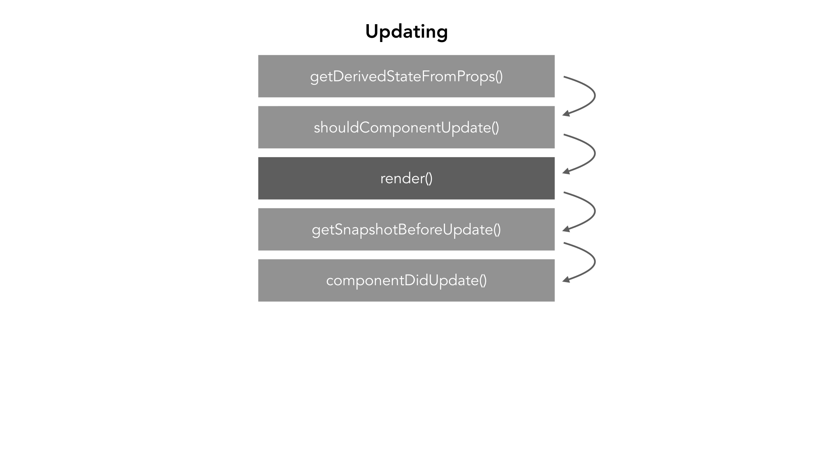

# React


## Was ist React?

[React](https://reactjs.org/) ist ein JavaScript Framework, von
Facebook, für die Erstellung von Benutzeroberflächen. Es ist eins der
größten JavaScript Frameworks neben Angular und Vue.js. React steht
aktuell bei der Version 16.8.6 vom 27. März 2019, die neusten Neuerungen
sind die sogenannten Hooks welche später genauer erläutert werden.

## Anforderungen

React bietet große Möglichkeiten SPA (_Singe Page Application_) und MPA
(_Multi Page Application_) zu erstellen, aber um mit React einem guten
Workflow nachgehen zu können benötigt man etwas Vorwissen. Man sollte
wissen wie sich der neue JavaScript Standard (_ES6_) verhält und was
genau der Unterschied zwischen SPA und MPA ist.

## Workflow

Die Dependencies spielen eine große Rolle in der heutigen Zeit von
JavaScript um dort den Überblick und den bestmöglichen Komfort zu bieten
wird einen sogenanntes Dependency Management Tool empfohlen. In diesem
Fall wird der Node Package Manager (_npm_) genutzt. Es wird ein Bundler,
der aus allen Dateien ein kompaktes Produkt formt, genutzt. React
verwendet dafür Webpack. Um wie oben, in den
[Anforderungen](#anforderungen) angesprochen, ES6 verwenden zu können
wird ein Compiler genutzt, dieser sorgt dafür das aus ES6 gängiges
JavaScript wird das für jeden modernen Browser verständlich ist. Diese
Arbeit nimmt bei React ein Tool ab, dieses Tool nennt sich
[create-react-app](https://github.com/facebook/create-react-app).

```bash
npm install -g create-react-app
create-react-app test-react-app
```

Um die App im Browser richtig darstellen zu können wird der
mitgebrachten Webserver über npm gestartet, die App ist dann über
[localhost:3000](http://localhost:3000) erreichbar. __Bei einer Änderung
an der App wird diese automatisch neu erstellt.__

```bash
npm start
```


## Components

Komponenten sind das grundlegendste in React, auch bekannt als
__Components__. Einzelne Components werden am Ende zu einer App
zusammengesetzt. Der Vorteil an Components ist das man sie immer wieder
verwenden und dynamisch anpassen kann. Jedes Component muss zwingend JSX
zurückgeben oder diesen rendern.


Der allgemeine Aufbau eines Components (_src/App.js_) in React sieht wie
folgt aus:

```jsx
import React, { Component } from 'react';
import './App.css';

class App extends Component {
  render() {
    return (
      <div className="App">
        <h1>Hello World</h1>
      </div>
    );
  }
}

export default App;
```

### Funktionale Components

Diese bezeichnet man als Präsentations- oder zustandslose Components, da
sie in den meisten Fällen nur JSX zurückgeben. Diese Art sollte so oft
wie nur möglich verwendet werden und gilt als Best-Practice, diese
bieten durch React Hooks fast die selben Möglichkeiten wie
klassenbasierte Components.

```jsx
import React from 'react';

const foobar = () => {
  return <p>Foobar!</p>
};

export default foobar;
```

### Klassenbasierte Components

Diese bezeichnet man als Container- oder Zustandscomponents, diese
verwendet man wie der Name schon sagt, wenn man Zustände in einem
Component speichern möchte. Um eigene Components dann zu verwenden, kann
man diese einfach einbinden und aufrufen. Hier zu wird das
funktionale Component aus dem oberen Beispiel genutzt und es in
die `App.js` importiert.

```jsx
import React, { Component } from 'react';
import './App.css';
import Foobar from './Foobar';

class App extends Component {
  render() {
    return (
      <div className="App">
        <h1>Hello World</h1>
        <Foobar />
      </div>
    );
  }
}

export default App;
```


## JSX

JSX ist die Sprache die zum darstellen von Components verwendet wird, um
genauer zu sagen der Teil der in die `render()`-Methode geschrieben
wird, man kann natürlich auch einfach so JSX-Code zurückgeben ohne eine
`render()`-Methode.

```jsx
render() {
 return (
   <div className="App">
     <h1>Hello World</h1>
   </div>
 );
}
```

Damit JSX verwendet werden kann, wird auch `React` in ein Component
importiert. React erstellt dann aus dem JSX für den Browser lesbares
JavaScript. Als Beispiel wird gezeigt wie der obere Code als
normales JavaScript aussieht und was React intern mit JSX macht.

```jsx
render() {
 return React.createElement('div', 
                            { className: 'App' }, 
                            React.createElement('h1', null, 'Hello World'));
}
```

JSX hat aber ein paar kleine Einschränkungen, es sieht zwar aus wie HTML
und es verhält sich auch in den meisten Fällen so, weswegen auch zum
Beispiel `className` genutzt wird anstatt die normale HTML-`class`, weil JSX
intern immer noch zu JavaScript kompiliert wird und `class` unter
JavaScript eine andere Verwendung findet. Außerdem kann man unter JSX im
Normalfall nur ein HTML Element zurückgeben, am folgenden Beispiel sieht
man wie es __nicht__ funktioniert.

```jsx
render() {
 return (
   <div className="App">
     <h1>Hello World</h1>
   </div>
   <p>I'm not working</p>
 );
}
```

Aus diesem Grund packt man um ein Component immer ein HTML-Element und
fügt seinen Kontent in dieses HTML-Element ein oder man nutzt `React.Fragment`
anstatt es in ein `<div></div>` zupacken.


## Properties

Eigenschaften, auch __Properties__ oder __Props__ genannt, bieten uns die
Möglichkeit den Inhalt der Components dynamisch anpassbar zu machen.
Diese kann man einfach bei den Aufruf des Components übergeben.

```jsx
<Foobar foo="bar" />
<Foobar foo="bar" >Foobar</Foobar>
```


Properties kann man dann einfach innerhalb des Components
verwenden. Im zweiten Aufruf, im Beispiel, wird es nicht als Attribut übergeben,
dies kann man einfach über `.children` abrufen.  
__Wichtig:__ Sollte man dasselbe bei einem klassenbasierten Component
machen, dann muss man es wie in dem unten gezeigten Beispiel, `this.props.foo`
verwenden.

```jsx
import React from 'react';

const foobar = (props) => {
  return (
    <div>
      <p>Foo{props.foo}!</p>
      <p>{props.children}</p>
    </div>
  );
};

export default foobar;
```

### State-Property

Die State-Property ist eine besondere Art von Property in React, sie
funktioniert wie ein Objekt in JavaScript, du kannst Sachen drin
speichern und abrufen. Das besondere daran ist, wenn man den Inhalt
ändert löst das ein neues Rendern im UI aus.

```jsx
class App extends Component {
  state = {
    foo: [
        'bar'
    ]
  }
    
  render() {
    return (
      <div className="App">
        <h1>Hello World</h1>
        <Foobar foo={this.state.foo[0]} />
      </div>
    );
  }
}
```

Um dafür zu sorgen das React das Ändern des State-Property mitbekommt
biete uns React, durch die Vererbung von `Component`, die Methode
`this.setState`. Diese Methode fügt dann das alte State-Property und das
neue State-Property zusammen, es werden nur die Objekte verändert die
auch wirklich durch `this.setState` verändert wurden.

Um States unter funktionalen Components verwenden zu können benutzt man
`useState`, hier ist aber wichtig das das neue State-Property das alte
__überschreibt__. `useState` kann dafür beliebig oft verwendet werden.

### PropTypes

ProTypes ist eine Bibliothek, die es ermöglicht festzulegen welche Typen
die zu übergebenden Properties haben sollen und warnt den Entwickler,
wenn diese nicht eingehalten werden. Diese Bibliothek ist von der React
Community entwickelt worden und muss nachinstalliert (`prop-types`)
werden.

```js
Greeting.propTypes = {
  name: PropTypes.string
};
```

Für weitere Typen die PropTypes mitliefert, siehe
[hier](https://reactjs.org/docs/typechecking-with-proptypes.html).

### Context

React bietet eine Option, Daten von Component A zu Component D zu
übergeben, diese Option nennt sich Context. Ein Beispiel für so eine
Anwendung ist zum Beispiel eine Authentifizierung.

__Context erstellen__  
Das Erstellen eines Context geschieht mit `React.createContext()`.
```jsx
import React from 'react';

const authContext = React.createContext({
  authenticated: false,
  login: () => {}
});

export default authContext;
```

__Context bereitstellen__  
Das Bereitstellen des Context geschieht in einem übergeordneten Component über `Context.Provider`.

```jsx
<AuthContext.Provider
  value={{
    authenticated: this.state.authenticated,
    login: this.loginHandler
  }}
>
<Element />
</AuthContext.Provider>
```

__Context verwenden__  
Das Verwenden vom Context ist mit `contextType` oder `useContext()` möglich.

Klassenbasierte Components:
```jsx
static contextType = AuthContext;
console.log(this.context.authenticated);
```

Funktionale Components:
```jsx
const authContext = useContext(AuthContext);
console.log(authContext.authenticated);
```


## Event-Handling

Event Handling ist unter React relativ ähnlich zum Event-Handling unter
JavaScript. Am folgenden Beispiel wird gezeigt wie das Event-Handling
unter React im Allgemeinen aussieht. Event-Handler können auch über
Properties weitergegeben werden.

```jsx
class App extends Component {
  eventHandler = () => {
    console.log('Button was clicked!');
  }
    
  render() {
    return (
      <div className="App">
        <button onClick={this.eventHandler}>Button</button>
      </div>
    );
  }
}
```

Für weitere Events siehe
[React Docs](https://reactjs.org/docs/handling-events.html).


## Lists

In diesem Teil wird erklären wie man Werte von Forms verändern kann, wie
If-Bedingungen und For-Schleifen unter React verwendet werden können.

### Two-Way Databinding

Im Vergleich zu Angular besitzt React kein ngModel, welches einem die
Arbeit dafür abnimmt. Das heißt man müssen selbst auf Änderungen
reagieren und Werte setzen.

Als erstes wird ein Event-Handler um auf diese Aktion reagieren
benötigt, also wenn etwas in das Input-Feld eingetragen wird, in dem
Beispiel wird ein Name im State-Property geändert.

```jsx
nameChangedHandler = ( event, id ) => {
  const personIndex = this.state.persons.findIndex(p => {
    return p.id === id;
  });

  const person = {
    ...this.state.persons[personIndex]
  };

  person.name = event.target.value;

  const persons = [...this.state.persons];
  persons[personIndex] = person;

  this.setState( { persons: persons } );
}
```

Diese Methode wird nun beim Rendern der Person Component übergeben, hier
ist wichtig das ein `Key` Attribut mit übergeben wird, das hilft React
dabei nur die geänderten Teile neu zu rendern.

```jsx
<Person
  name={ person.name } 
  age={ person.age }
  key={ person.id }
  changed={ (event) => this.nameChangedHandler(event, person.id) } />
```

Das Component kann nun auf das Attribut reagieren.

```jsx
<input type="text" onChange={ props.changed } value={ props.name } />
```

### If-Bedingungen

Auch dies ist etwas ungewohnter als unter Angular, es gibt unter React
keine Directives (_ngIf_). Es wird einfaches JavaScript genutzt. Es
werden zwei Möglichkeiten geboten. Die erste Möglichkeit ist es die
If-Bedingung direkt im JSX einzubinden.

```jsx
return (
  <div className="App">
    { 1 + 2 === 4 ? <div>Hello World</div> : null }
  </div>
);
```

Die zweite Möglichkeit ist das ganze auszulagern.

```jsx
if ( 1 + 2 === 4 ) {
  helloWorld = (
    <div>Hello World</div>
  );
}

return (
  <div className="App">
    { helloWorld }
  </div>
);
```


### For-Schleifen

Diese können unter React wirklich simpel durch die JavaScript Methode
`map` verwirklicht werden, diese liefert jedes Array unter JavaScript
mit.

```jsx
if ( this.state.showPersons ) {
  persons = (
    <div>
      {this.state.persons.map((person, index) => {
        return <Person
          name={ person.name } 
          age={ person.age }
          key={ person.id }
          changed={ (event) => this.nameChangedHandler(event, person.id) } />
      })}
    </div>
  );
}
```

### Refs

__Refs__ sind eine Möglichkeit von React auf die Elemente zuzugreifen
ohne die standardmäßige JavaScript-Funktion zuverwenden. Wichtig hier
bei ist es, Refs nicht für alles zu verwenden.  
Gute Möglichkeiten Refs zu verwenden sind:
- Verwaltung von Fokusse der Elemente
- Auslösen von Animationen
- Third-Party Bibliotheken für die DOM-Manipulation

__Refs erstellen__

```jsx
class MyComponent extends React.Component {
  constructor(props) {
    super(props);
    this.myRef = React.createRef();
  }
  render() {
    return <div ref={this.myRef} />;
  }
}
```

__Refs verwenden__

```jsx
const node = this.myRef.current;
```

Für eine genauere Dokumentation, siehe
[hier](https://reactjs.org/docs/refs-and-the-dom.html).


## Styling

Wie unter normalen HTML gibt es auch hier die Möglichkeit Inline Styling
oder via externe `.css`-File Stylings vorzunehmen. Als erstes wird das
Styling via `.css`-File an dargestellt.

Hier für muss nur die `.css`-File importiert werden.

```jsx
import React from 'react';
```

Nun kann man die Klassen via `className` verwenden.  
__Wichtig hier bei ist das alle Änderungen in der `.css`-File global sind.__  
Für das Inline Styling muss eine Anweisung in JavaScript
verfasst werden.

```jsx
const style = {
  backgroundColor: 'white',
  border: '1px solid blue'
};
```

Jetzt muss dies nur noch in den JSX Code verwendet werden.

```jsx
return (
  <div className="App">
    <h1 style={ style }>Hi, I'm a React App</h1>
  </div>
);
```

### Radium

Radium ist eine Reihe an Tools, die die Möglichkeit bieten
Inline Styles in einem React Component zu verbessern. Diese bauen
außerdem auch Pseudo Selektoren, Media Queries und vieles mehr als
Inline Styling ein.

Um es aber nun auch verwenden zu können muss es in der Datei, wo
es verwendet werden soll, noch eingebunden und das Component beim
zurückgeben darin eingepackt (_wrapping_) werden.

```jsx
import Radium from 'radium';
```

```jsx
export default Radium(App);
```

Nun können Pseudo Selektoren in Inline Styling verwenden.
Alle Pseudo Selektoren sind unterstützt.

```jsx
const style = {
  backgroundColor: 'white',
  border: '1px solid blue',
  'hover': {
    backgroundColor: 'black',
    color: 'white'
  }
};
```

Als nächstes wird dargestellt wie man Media Queries unter Radium und
React verwendet, als Inline Styling.

```jsx
const style = {
  '@media (min-width: 500px)': {
      width: '450px'
  }
};
```

Um Media Queries verwenden zu können, muss die App in ein `StyleRoot` gepackt werden,
dasselbe gilt auch für Keyframes.

```jsx
return (
  <StyleRoot>
    <div className="App">
      { helloWorld }
    </div>
  </StyleRoot>
);
```

### Aphrodite

[Aphrodite](https://github.com/Khan/aphrodite) ist eine weitere
Bibliothek für React, die es einem ermöglicht Inline-Style mit
Pseudo-Selektoren und Media Queries zu verwenden. Der größte Unterschied
zu Radium ist, dass es unter Aphrodite eine Möglichkeit gibt
`@font-face` zu verwenden, das man seine Style-Objekte bei der
`StyleSheet.create()`-Funktion übergibt und das man diese in an
`className` übergibt anstatt an `style`, über die Funktion `css`.
Ebenfalls ist es eine Sache von Aphrodite, dass alle Styling bekommen
das `!important`-Tag, dafür kann man aber `aphroidte/no-important`
importieren.

Anhand eines Beispiel lässt sich das besser verdeutlichen:

```jsx
import { StyleSheet, css } from 'aphrodite';

const styles = StyleSheet.create({
                 panel: {
                   backgroundColor: '#00ffff',
                   ':hover': {
                     color: '#ffffff',
                     cursor: 'pointer'
                   },
                   '@media (max-width: 700px)': {
                     backgroundColor: '#ff0000'
                   }
                 }
               });

class App extends Component {
  render() {
    return (
      <div className={css(styles.panel)}>
        React + Aphrodite rocks!
      </div>
    );
  }
}
```

### Emotion

[Emotion](https://emotion.sh/) ist die dritte und letzte Bibliothek für
Inline Styling unter React, die hier behandelt wird. Sie bietet dasselbe
wie die Aphrodite, sie nutzt ebenfalls `className` und eine Funktion die
`css` heißt. Anstatt eines Objekt, welches an `className` übergeben
wird, übergibt man ein sogenanntes "tagged Template". Emotion hat den
größten Vorteil, dass es mehr nach CSS aussieht als bei den anderen
beiden Bibliotheken. Es gibt hier bei auch eine weitere Bibliothek die
sich `react-emotion` nennt, diese ermöglicht es einem mit der Funktion
`styled()` eigene HTML zu erstellen und diese unter JSX zu verwenden.

Alles nochmal zusammenfassend als Beispiel:

```jsx
import { css } from 'emotion';

const style = css`
  background-color: #00ffff;
  text-align: center;
  width: 100%;
  padding 20px;
  &:hover {
    color: #ffffff;
    cursor: pointer;
  }
  @media (max-width: 700px) {
    background-color: #ff0000;
  }
`;

class App extends React.Component {
  render() {
    return (
      <div className={style}>
        React + Emotion rocks!
      </div>
    );
  }
```

### CSS Modules

Es gibt auch die Möglichkeit die Scopes der Styles
anzupassen, hierzu müssen, aber paar Konfigurationen angepasst werden. Dazu
muss `react-scripts` aufgerufen werden.

```bash
react-scripts eject
```

Jetzt wird noch die `webpack.config.js` angepasst, diese ist im neu generierten
`config`-Ordner. Ab _Zeile 391_, sie sollte wie folgt aussehen:

```jsx
{
  test: cssRegex,
  exclude: cssModuleRegex,
  use: getStyleLoaders({
    importLoaders: 1,
    sourceMap: isEnvProduction && shouldUseSourceMap,
  }),
  sideEffects: true
}
```

Diese wird so angepasst, dass der CSS-Loader einzigartige Klassen
daraus generieren kann.

```jsx
{
  test: cssRegex,
  exclude: cssModuleRegex,
  use: getStyleLoaders({
    importLoaders: 1,
    modules: true,
    localIdentName: '[name]__[local]__[hash:base64:5]',
    sourceMap: isEnvProduction && shouldUseSourceMap,
  }),
  sideEffects: true,
}
```

Alternativ muss man kein `react-scripts` dafür ausführen, mehr dafür
siehe
[hier](https://facebook.github.io/create-react-app/docs/adding-a-css-modules-stylesheet).

Nun muss nur noch der JavaScript-Code angepasst werden,
dies wird unten anhand eines Beispiels gezeigt.

```jsx
import classes from './App.css';
```

```jsx
return (
    <div className={classes.App}>
    </div>
);
```


## Lifecycle Hooks

Lifecycle Hooks sind eine Möglichkeit Code auszuführen, zu bestimmten
Zuständen von klassenbasierten Components.

### Mounting

Diese Lifecycle Hooks werden aufgerufen wenn eine Instanz eines
Components erstellt und zum DOM hinzugefügt wird, in der unten
aufgeführten Reihenfolge.

- [__`constructor()`__](https://reactjs.org/docs/react-component.html#constructor)
- [__`static getDerivedStateFromProps()`__](https://reactjs.org/docs/react-component.html#static-getderivedstatefromprops)
- [__`render()`__](https://reactjs.org/docs/react-component.html#render)
- [__`componentDidMount()`__](https://reactjs.org/docs/react-component.html#componentdidmount)


### Updating

Diese Lifecycle Hooks werden aufgerufen, in dieser Reihenfolge, wenn das
Component neu gerendert wird.

- [__`static getDerivedStateFromProps()`__](https://reactjs.org/docs/react-component.html#static-getderivedstatefromprops)
- [__`shouldComponentUpdate()`__](https://reactjs.org/docs/react-component.html#shouldcomponentupdate)
- [__`render()`__](https://reactjs.org/docs/react-component.html#render)
- [__`getSnapshotBeforeUpdate()`__](https://reactjs.org/docs/react-component.html#getsnapshotbeforeupdate)
- [__`componentDidUpdate()`__](https://reactjs.org/docs/react-component.html#componentdidupdate)

`shouldComponentUpdate()` kann weggelassen werden wenn man
`PureComponent` importiert statt `Component`.



### Unmounting

Diese Lifecycle Hooks werden aufgerufen, wenn das Component vom DOM
entfernt wird.

- [__`componentWillUnmount()`__](https://reactjs.org/docs/react-component.html#componentwillunmount)


### useEffect() und React.memo()

Seit React 16 gibt es durch React Hooks die Möglichkeit so etwas auch in
funktionale Components einzubinden, durch `useEffect()` und um dasselbe
wie `PureComponent` unter funktionalen Components zu verwenden, kann man
`React.memo()` einbinden.

```jsx
import React, { useEffect } from 'react';

const foobar = props => {
  useEffect(() => {
    console.log('[Foobar.js] useEffect');
    // Http request...
    setTimeout(() => {
      alert('Saved data to cloud!');
    }, 1000);
    return () => {
      console.log('[Foobar.js] cleanup work in useEffect');
    };
  }, []);

  return (
    <div>
      <p>Hello World!</p>
    </div>
  );
};

export default React.memo(foobar);
```


## Quellen

- [Inline Styling with Radium, Aphrodite & Emotion](https://blog.logrocket.com/the-best-react-inline-style-libraries-comparing-radium-aphrodite-emotion-849ef148c473)
