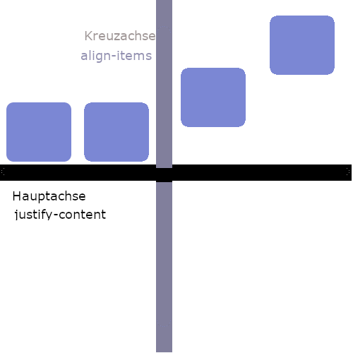
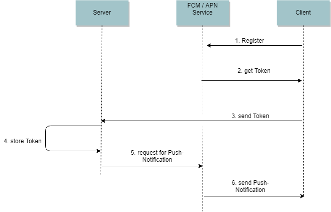

# React-Native

## Inhaltsverzeichnis

 * [Einleitung](##Einleitung)
   * [Was ist React-Native](###Was%20ist%20React-Native)
   * [Wie funktioniert React-Native](###Wie%20funktioniert%20React-Native)

 * [Grundlegende Konzepte](###Grundlegende%20Konzepte)
   * [Native Code](###Native%20Code)
   * [Navigation](###Navigation)
   * [Components](###Components)

 * [User Interfaces](##User%20Interfaces)
   * [Touch and Gesture](###Touch%20and%20Gesture)
   * [Animations](###Animations)
   * [Layouting](###Layouting)
   * [Styles](###Styles)
   * [JSX](###JSX)

 * [State Management](##State%20Management)
   * [State](###State)
   * [Props](###Props)
     * [PropType](###PropType)
   * [Redux](###Redux%20unter%20React%20Native)
   * [React Context](###React%20Context)

 * [Services](##Services)
   * [Push-Benachrichtigung](###Push-Benachrichtigung)
   * [Http-Request](###HTTP-Request)
   * [Websockets](###Websockets)
   * [Datenbank/Persistener%20Speicher](###Datenbank/Persistener%20Speicher)

 * [Tooling](##Tooling)
  
 * [Testing](##Testing)
   * [Unit-Test](###Unit-Test)
 * [Quellen](##Quellen)

## Einleitung

### Was ist React-Native?

Mit React-Native lassen sich Android- und iOS-Applikationen mit nur einem Code realisieren. Diese Applikationen
wirken sehr nativ, obwohl die mit Javascript geschrieben wurden sind. React-Native ist ein Javascript Framework 
und wurde von Facebook entwickelt. Als Basis dient React, welches eine Javascript Bibliothek ist und auch von 
Facebook entwickelt wurde. Deshalb sind sich auch React und React-Native sehr ähnlich. Wie auch in React, ist 
JSX in React-Native verfügbar. Des weiteren ist es möglich über Javascript-Schnittstellen, die von React-Native 
bereitgestellt werden, auf die API, der jeweiligen Plattform zu zugreifen. Dadurch ist es beispielsweise möglich,
auf die Kamera zu zugreifen.

Da React-Native auf React basiert, empfiehlt es sich in [React](https://github.com/AHeinisch/Full-Stack/blob/master/docs/react/index.md) einzulesen.

### Wie funktioniert React-Native

React-Native funktioniert ähnlich wie React mit dem Browser DOM. Statt einen Browser Dom zu rendern nutzt React-Native die API, der jeweiligen Plattform, um die Komponenten zu rendern. Eine React-Natve View wird dann beispielsweise über die jeweilige "Bridge" zu UIView in iOS. Es ist möglich weitere "Bridges" zu entwickeln, um mit React Native für weitere Plattformen zu entwickeln. So gibt es eine React-Native Version, mit der es möglich ist eine Desktopandwendung für Windows und Ubuntu zu entwickeln.   

## Grundlegende Konzepte 

### Native Code

--TODO--

### Navigation

Um einen Wechsel von einer View zur Anderen zu betätigen, wird eine extra Library gebraucht. In diesem Kontext bedeutet der Begriff View eine funktionale React-Komponente, die keine Geschäftslogik beinhaltet. React Native selbst bietet keine Lösung zur Navigation an. Stattdessen werden auf die React-Navigation- und React-Native-Navigation-Library hingewiesen. Die React-Native-Navigation-Library hat den Vorteil gegenüber der von React, dass diese einen nativen Eindruck hinterlässt.

Im folgenden wird erläutert wie in React Native Apps mit der Library React-Native-Navigation die Navigation funktioniert. React-Native-Navigation ist in TypeScript geschrieben und unterstützt die gängigsten Statemanagement-Libraries. Damit eine Navigation von einer View zur Nächsten funktionieren kann, müssen die Views in der index.js Datei registriert werden. Dies geschieht über die Methode registerComponent(uniqueName, View). Hierbei ist zu beachten, dass jede View einen einzigartigen Namen haben muss.

Die Bibliothek bietet verschiedene Möglichkeiten die Navigation zu strukturieren. Hier stehen verschiedene Layouttypen an. Der Component-Layout enthält nur eine Reactkomponente. Mit dem Stack-Layout ist es möglich beliebige Layouts zu Views zu beinhalten. Zudem existiert noch das Layout BottomTabs, wechles Icons anzeigen kann und ein Seitenmenü sideMenu-Layout.

Mit React Native Navigation ist es möglich auf gewisse Events zu reagieren. Zu diesen gehören unter anderem der Start der App, das Hinzufügen von Views in dem Stack, das Anzeigen einer View als Modalview und beim Auswählen eines Tabs im BottomTab.

Der Navigator lässt sich wie jede andere Reactkomponente stylen. Dies geschieht über das übergeben eines options Objekt. Für ein einheitliches Erscheinen, dient die Funktion setDefaultOptions, die laut den Entwicklern vor der SetRoot Methode geruft werden sollte. Das Aussehen kann im Allgemeinen für beide Plattformen gesetzt werden oder auch plattformspezifisch. Mit der Funtktionen mergeOptions kann der Navigator dynamisch zur Laufzeit angepasst werden.

### Components

#### Listen

--TODO--

#### Tabellen

--TODO--

## User Interfaces

### JSX

JSX ist eine Javascript Erweiterung. XML wird genutzt, um Daten intern zu strukturieren und sinnvoll anzuordnen.
Dabei werden von JSX die HTML-Dateien in die Javascript-Dateien eingebettet. Sprich mit JSX ist es möglich Auszeichnungssprachen
in Javascripte zu nutzen. 

### Touch and Gesture

--TODO--

### Animations

--TODO--

### Layouting

Das Arrangieren der Komponenten in React Native wird durch Flexbox ermöglicht. Flexbox ist ein CSS3 Layout-Module. Mit Flexbox ist ein konsistentes Layout bei verschiedenen Displayauflösungen möglich. 

Flexbox funktioniert in React Native wie in CSS im Web, mit abgesehen von ein paar Ausnahmen. Zu diese Ausnahmen gehört unteranderem, dass der Default-Wert der Property flexDirection column ist und der Parameter flex nur Zahlen annimmt.

Beim Arbeiten mit Flexbox kann man sich zwei Achsen vorstellen. Die Hauptachse und die Kreuzachse. Die Hauptachse wird definiert durch die Property flex-direction.

Flex-direction kann folgende Werte annehmen:

* row	 
  * Die Komponenten werden horizontal von links nach rechts angeordnet.
* row-reverse
  * Die Komponenten werden horizontal von rechts nach links angeordnet.
* column
  * Die Komponenten werden vertikal von oben nach unten angeordnet.
* Coulmn-reverse
  * Die Komponenten werden vertikal von unten nach oben angeordnet.

Der Verlauf der Kreuzachse ist abhängig von der Hauptachse. Wenn die Hauptachse entlang der Zeile ausgerichtet ist, dann verläuft die Kreuzachse entlang der Spalte. Verläuft die Hauptachse entlang der Spalte, dann verläuft die Kreuzachse entlang der Zeile. Dieses Wissen ist nützlich, wenn man sich mit der Ausrichtung des Inhalts beschäftigt.

Die Flex-Property gibt an, wie sich die Komponenten in Bezug auf ihrer Größe verhalten sollen. Ist der Wert von Flex positiv, so wir die Komponente um das Vielfache größer, sofern so viel Platz im Flex-Container frei ist. Der Flex-Container ist der Bereich, in dem Flexbox genutzt wird.  Die Komponente ist dann bezüglich ihrer Größe flexible. Ist der Wert der Property gleich 0, so bleibt die Komponente bei ihrer festen Größe. Sie ist dann nicht flexibel. Bei -1 wird die Komponente auf ihre minWidth und minHeight Werte geschrumpft, sofern nicht genügend Platz gibt im Flex-Container.



justify-content ordnet die Items auf der Haupt-Achse, align-items ordnet die Items auf der Kreuz-Achse und flex-direction dreht die Haupt-Achse.

### Styles

Zum Stylen der Komponeten wird jeglich JavaScript benötigt. Die Styles werden in der Property Style gesetzt. Die Style Property ist im Besitz jeder Komponente. Die Style-Namen und Werte entsprechen die in CSS mit ein paar Ausnahmen. In React Native werden die Style-Namen nach der Camel Case Konvention geschrieben. 

Die Styles können in derselben Zeile gesetzt wie die Komponete, die gestyled werden soll.
```
<Text style={{color:'red'}}>Red text</Text>
```
Mit StyleSheet.create ist es möglich ein "Style"-Objekt zu definieren, dass von verschiedenen Komponenten verwendet werden kann.

Die Styles können bedingt gestetzt werden.

```
<View style={[(this.props.isTrue) ? styles.bgcolorBlack : styles.bgColorWhite]}>
```

## State Management

Im folgenden wird 
Für einen allgemeinen Einblick ins State Management wird die Ausarbeitung [State Management](https://github.com/AHeinisch/Full-Stack/blob/master/docs/state-managment/index.md) empfohlen. 

### States

Innerhalb der Komponenten werde diese mithilfe der States gesteuert.  Dies geschieht durch die Methode setState, die entweder ein Key-Value-Objekt annimmt oder eine Funktion, die ein Key-Value-Objekt zurückgibt. SetState löst das Rerendern der Komponente sowie der Kinderkomponenten aus. Die Zustande sollten im Konstruktor initialisiert.

### Props 

Mithilfe von Props kurzform für Properties werden die Komponeten mit Daten befüllt. Komponenten können verschachtelt sein. So kann eine Komponente Kinder haben oder ist selbst ein Kind sein. Die Elternkomponenten setzen die Props der jeweiligen Komponenten. Props sollten selbst für die eignene Komponente unveränderlich. //Todo warum sollten props unveränderlich sein für die eigne Komponente? 
Die UI-Komponenten werden basierend  nach den States und Props gerendert. Die Komponenten können über die Props von außerhalb gesteuert werden.

#### PropTypes

PropTypes ist ein Package, dass genutzt werden kann um während der Laufzeit zu Prüfen, ob eine Property mit dem richtig Typ gesetzt wurde.
Beispiel:
```
name: PropTypes.string.isRequired
```
Die Property name ist vom Typ String und muss gesetzt sein.

Zudem kann eine Property mehrere propTypes haben. Dies mit **oneOfType möglich.

```
name: PropTypes.oneOfType ( [
    PropTypes.string,
    PropTypes.object
] )
```
Mit defaultProp ist es möglich Defaultwerte zu setzen für Properties. Diese werden übernommen, wenn die Properties nicht gesetzt werden.

```
myComponent.defaultProps = {
    name : 'Simon'
}
```

### Redux unter React Native

--TODO--

### React Context

--TODO--

## Services

### GraphQL unter React-Native

Mit Apollo Client lassen sich GraphQl Anfragen versenden. 

Die Installation erfolgt über den folgenden NPM-Befehl:
´´´
npm install apollo-client apollo-link-http apollo-cache-inmemory graphql-tag react-apollo --save

Der ApolloClient wird wie folgt initialisiert.

´´´
import { ApolloClient } from 'apollo-client';
import { InMemoryCache } from 'apollo-cache-inmemory';
import { HttpLink } from 'apollo-link-http';

const cache = new InMemoryCache();
const link = new HttpLink({
  uri: 'http://localhost:4000/'
})

const client = new ApolloClient({
  cache,
  link
})

Die folgende Anfrage, fragt über deviceQeuery nach einer DeviceID. Wenn die Anfrage erfolgreich war, stehen im Response unter Data die DeviceIDs.

´´´
client.query({
  query: gql`
  {
    deviceQuery {  // Die Query, die auf dem Server definiert ist.
      DeviceID      // Der verlangte Rückgabewert
    }
  }
  `
}).then(response => console.log(response.data)); 
´´´

### Push-Benachrichtigung

Eine Push-Benachrichtigung ist eine Mitteilung, die vom App-Betreiber an dem Nutzer gesendet wird. React-Native bietet zur Zeit nur eine API für IOs Push-Benachrichtigungen. Wenn auf den Androidgeräten auch Push-Benachrichtigungen angezeigt werden sollen, so muss auf nativer Code zugegriffen werden oder auf eine externe Bibliothek. 

Ablauf von Push-Benachrichtigungen


1. Sobald die App gestartet wurde, registriert sie sich beim jeweiligen Service an. Dieser kann entweder FCM(Google) oder APN(Apple) sein.
2. Der Service sendet dem Client einen Token zur Identifikation.
3. Der Client sendet den erhaltenen Token an dem App-Server.
4. Der Server speichert sich diesen Token.
5. Der Server sendet eine Anfrage zum Versenden von Push-Benachrichtigungenn an den jeweiligen Service. In dieser Anfrage sind die Token, der Clients sowie die Nachricht, an den gerichteten Clients enhalten.
6. Der jeweilige Service sendet die Push-Benachrichtigung an adressierten Client mit der gelieferten Nachricht.

Die Bibliothek react-native-push-notficaiton von zo0r bietet die möglichkeit mit einem Code das Feature umzusetzen. 

### HTTP-Request

Für Serveranfragen bietet React Native die Fetch API an. Die Fetch Funktion nimmt zwei Parameter entgegen. Zum einen eine URL und zum anderen die Spezifikation der Anfrage. Beim zweiten Parameter lassen sich unter anderem die Methode setzen, Header hinzufügen und den Body spezifizieren. Der erste Parameter wird für eine Anfrage vorausgesetzt. Der andere Parameter ist optional. Die Anfragen über die Fetch APi sind asynchron. Als Rückgabewert wird ein Promise geliefert.

### Websockets

Websocket ist ein Protokoll für eine Vollduplex Verbindung zwischen Client und Server. Bei einer Websocket-Verbindung wird eine persistene Verbindung zwischen Client und Server hergestellt. Mit dieser Verbindung können beide jederzeit Daten zueinander versenden. React Native unterstützt dieses Protokoll. 

Die Websocket Api verfügt über zwei Methoden und einigen Properties. Mit der close Methode wird die Verbindung geschlossen. Es kann ein Statuscode angegeben werden durch den Parameter code, als auch ein Grund genannt werden über den Parameter reason, der einen 12 Byte langen String enthalten kann. Über die send-Methode können Daten versendet werden. Die Daten werden im dem Parameter data der Methode gesetzt. Die Property kann einen der folgenden Typen annehmen.

* USVString
* ArrayBuffer
* Blob
* ArrayBufferView

Über die Properties onopen, onclose, onerror und onmessage ist es mögich bestimmte Events abzufangen. Dazu wird den genannten Properties eine Funktion zugewiesen. Wenn das Event auftretet wird die zugewiesene Funktion ausgeführt.
 
´´´
var webSocket = new WebSocket('ws://host.com/path');
webSocket.onmessage = (event) => {
  console.log(event.message);
};

´´´

### Datenbank/Persistenter Speicher

--TODO--

## Tooling

### Debugging Tools

--TODO--

### Development Tools

--TODO--

## Testing

### Unit-Test

--TODO--

## Quellen
